## RabbitMQ

### AMQP协议

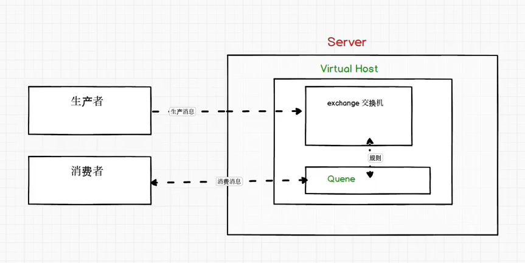

生产者连接`Server`绑定一个通过User用户名和密码连接对应的`Virtual Host`，将消息发生给`exchaghe`，然后消费者也连接上`Virtual Host`，从`Queue`中取消息；**生产者可以直接把消息发给`exchange`也可以发给队列`Queue`**

### 第一种直连

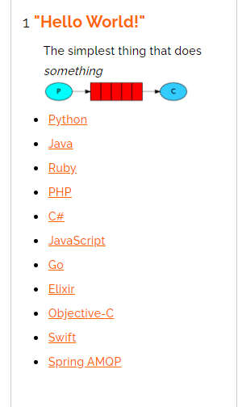

+ p:生产者，要发送消息的程序
+ c:消费者，消息接受者，一直等到消息的到来
+ queue: 消息队列，图中红色部分，可以缓存消息：生产者向其投递，消费者从中取出；

**Provider**:

```java
public class Provider {

    @Test
    public void testSendMessage() throws IOException, TimeoutException {
        Connection connection = RabbitMQUtils.getConnection();

        // 获得通道
        Channel channel = connection.createChannel();

        // 通道获取消息队列
        // 参数1：队列名称，不存在自动创建
        // 参数2： 队列是否持久化， true表示持久化 则重启后消息队列不消失，但是其中的消息消失   如果为false 重启Rabbit MQ则消息队列消失
        // 参数3： exclusive 是否独占队列 true表示独占
        // 参数4： autoDelete 是否消费完后消费队列， true表示自动删除
        // 参数5：附加参数
        channel.queueDeclare("hello",false,false,false,null);
        // 发送消息，交换机名称，空代表默认交换机， hello 队列名称，props:额外消息设置 参数4：消息内容
        // 真正发送消息的是 basicPublish 一个channel可以发送到不同的队列 除非 channel.queueDeclare exclusive参数为 true
        // MessageProperties.MINIMAL_PERSISTENT_BASIC 持久化其中的消息
        channel.basicPublish("","hello", MessageProperties.MINIMAL_PERSISTENT_BASIC,"Hello World".getBytes());

        RabbitMQUtils.closeConnectionAndChannel(connection,channel);
    }
}
```

**customer**:

```java
public class Customer {
    public static void main(String[] args) throws IOException, TimeoutException {
        Connection connection = RabbitMQUtils.getConnection();
        Channel channel = connection.createChannel();

        channel.queueDeclare("hello",false,false,false,null);
        channel.basicConsume("hello",true,new DefaultConsumer(channel){
            @Override
            public void handleDelivery(String consumerTag, Envelope envelope, AMQP.BasicProperties properties, byte[] body) throws IOException {
                System.out.println("received message : " + new String(body));
            }
        });
    }
}
```

**RabbitMQUtils**:

```java
public class RabbitMQUtils {
    private static ConnectionFactory connectionFactory;
    static {
        // 创建连接mq的工厂
        connectionFactory = new ConnectionFactory();
        // 连接server
        connectionFactory.setHost("127.0.0.1");
        // 设置端口号
        connectionFactory.setPort(5672);
        // 设置连接虚拟主机
        connectionFactory.setVirtualHost("/ems");
        // 通过用户的 用户名密码连接
        connectionFactory.setUsername("ems");
        connectionFactory.setPassword("123");
    }

    public static Connection getConnection(){
        try {
            // 获取连接对象
            return connectionFactory.newConnection();
        } catch (Exception e) {
            e.printStackTrace();
        }
        return null;
    }

    public static void closeConnectionAndChannel(Connection connection, Channel channel){
        try {
            if(channel != null) channel.close();
            if(connection != null) connection.close();
        } catch (Exception e) {
            e.printStackTrace();
        }
    }
}
```

### 第二种模型（work queue）

主要解决第一种模型出现的问题 --- 类似于数据库主从同步中relay log堆积一样，如果消费者能力不够，则会导致队列中大量数据堆积，故采用类似于数据库主从的解决方案（MTS）  ----- Task Queues

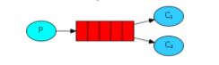

customer1:

```java
public class Customer1 {
    public static void main(String[] args) throws IOException {
        Connection connection = RabbitMQUtils.getConnection();
        Channel channel = connection.createChannel();
        channel.queueDeclare("work",true,false,false,null);
        
        channel.basicConsume("work",true,new DefaultConsumer(channel){
            @Override
            public void handleDelivery(java.lang.String consumerTag, Envelope envelope, AMQP.BasicProperties properties, byte[] body) throws IOException {
                System.out.println("received message 1 : " + new String(body));
            }
        });
    }
}
```

customer2:

```java
public class Customer2 {
    public static void main(String[] args) throws IOException {
        Connection connection = RabbitMQUtils.getConnection();
        Channel channel = connection.createChannel();

        channel.queueDeclare("work",true,false,false,null);
        channel.basicConsume("work",true,new DefaultConsumer(channel){
            @Override
            public void handleDelivery(String consumerTag, Envelope envelope, AMQP.BasicProperties properties, byte[] body) throws IOException {
                System.out.println("received message 2 : " + new String(body));
            }
        });

    }
}
```

测试结果：

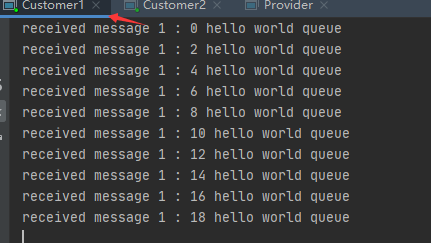

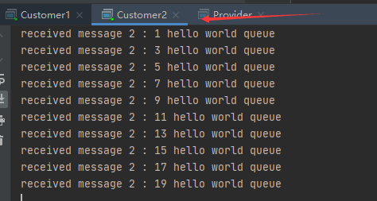

官方文档说明：

```txt
By default, RabbitMQ will send each message to the next consumer, in sequence. On average every consumer will get the same number of messages. This way of distributing messages is called round-robin. Try this out with three or more workers
翻译：默认情况下，RabbitMQ将按顺序将每条消息发送给下一个使用者。平均而言，每个消费者将获得相同数量的消息。这种分发消息的方式称为循环。和三个或更多的工人一起试一试。
```

> 那么如何使其不平均呢，也就是消费得快的多消费，慢的少消费？

要解决上面的问题要先说下消息队列的**确认机制**了。

**第二个参数为autoACK，如果为true，则代表队列给一个消息给消费者，消费者拿到，则消息队列认为其消费完了，其实消费者还要处理一段时间，有的消费者处理的很慢；**
**如果总共有五个消息如果在处理第三个消息消费者宕机则会丢失后面两个消息，对业务影响特别大；**

```java
channel.basicConsume("work",true 改为 flase,new DefaultConsumer(channel){
});
```

故不可以把所有消息一次性给消费者，而且要设置`autoACK`参数为false；

```java
// 一次处理一个消息
channel.basicQos(1);
// 没有了自动确认则要手动确认消息
channel.basicAck(envelope.getDeliveryTag(),false);
```

### 第三种模型(fanout)

**fanout 扇出 也称广播；**

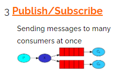

+ 多个消费者
+ 多个队列，都绑定到exchange
+ 生产者发送给exchange，交换机来决定要发送给哪个队列

代码示例：

**Provider**:

```java
public class Provider {
    public static void main(String[] args) throws IOException {
        Connection connection = RabbitMQUtils.getConnection();
        Channel channel = connection.createChannel();
        // 创建交换机
        channel.exchangeDeclare("logs","fanout");
        channel.basicPublish("logs","",null,"fanout type message".getBytes());
        // 释放资源
        RabbitMQUtils.closeConnectionAndChannel(connection,channel);
    }
}
```

三个一样的**consumer**:

```java
public class consumer1 {
    public static void main(String[] args) throws IOException {
        Connection connection = RabbitMQUtils.getConnection();
        Channel channel = connection.createChannel();
        // 绑定交换机
        channel.exchangeDeclare("logs","fanout");
        // 临时队列
        String queue = channel.queueDeclare().getQueue();
        // 绑定交换机和队列
        channel.queueBind(queue,"logs","");

        channel.basicConsume(queue,true,new DefaultConsumer(channel){
            @Override
            public void handleDelivery(String consumerTag, Envelope envelope, AMQP.BasicProperties properties, byte[] body) throws IOException {
                System.out.println("消费者1: " + new String(body));
            }
        });

    }
}
```

运行后发现：

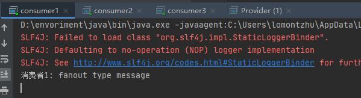

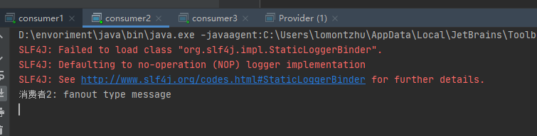

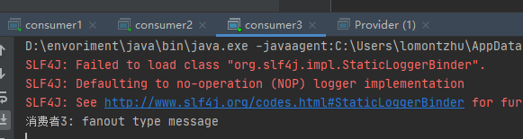

**生产者生产一条消息，每个消费者都消费了；**

### 第四种模型（Routing）

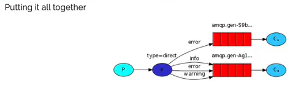

`在Fanout模式中，一条消息，会被所有订阅的队列消费。但在某些场景，我们希望不同的消息被不同的队列消费，这是就要用到Direct类型的Exchange。`

在Direct模式下：

+ 队列与交换机的绑定，不能是任意的绑定了，而是要指定一个`RoutingKey`（路由Key）
+ 消息发送方向Exchange发送消息时，也指定`RoutingKey`
+ `Exchange`不再把消息发给每一个绑定的队列，而是根据Routing Key进行判断，只有队列`RoutingKey`与消息`Routing Key`完全一致，才会收到消息

代码示例：

**provider**:

```java
public class provider {
    public static void main(String[] args) throws IOException {
        Connection connection = RabbitMQUtils.getConnection();
        Channel channel = connection.createChannel();
        // 声明交换机， 参数1：交换机名称  参数2：交换机类型
        channel.exchangeDeclare("logs_direct","direct");

        String routingKey = "error";
        channel.basicPublish("logs_direct",routingKey,null,("这是" +
                "direct模型发布基于rout key : [" + routingKey + "] 发送的消息").getBytes());

        RabbitMQUtils.closeConnectionAndChannel(connection,channel);
    }
}
```

**customer1**:

```java
public class Customer1 {
    public static void main(String[] args) throws IOException {
        Connection connection = RabbitMQUtils.getConnection();
        Channel channel = connection.createChannel();
        channel.exchangeDeclare("logs_direct","direct");

        // 获取临时队列
        String queue = channel.queueDeclare().getQueue();
        // 基于route key绑定队列和交换机
        channel.queueBind(queue,"logs_direct","error");
        channel.basicConsume(queue,true,new DefaultConsumer(channel){
            @Override
            public void handleDelivery(String consumerTag, Envelope envelope, AMQP.BasicProperties properties, byte[] body) throws IOException {
                System.out.println("消费者1 ： " + new String(body));
            }
        });
    }
}
```

**customer1**:

```java
public class Customer2 {
    public static void main(String[] args) throws IOException {
        Connection connection = RabbitMQUtils.getConnection();
        Channel channel = connection.createChannel();
        // 声明交换机
        channel.exchangeDeclare("logs_direct","direct");
        // 临时队列
        String queue = channel.queueDeclare().getQueue();
        channel.queueBind(queue,"logs_direct","info");
        channel.queueBind(queue,"logs_direct","error");
        channel.queueBind(queue,"logs_direct","warning");

        channel.basicConsume(queue,true,new DefaultConsumer(channel){
            @Override
            public void handleDelivery(String consumerTag, Envelope envelope, AMQP.BasicProperties properties, byte[] body) throws IOException {
                System.out.println("消费者2 ： " + new String(body));
            }
        });
    }
}
```

### 第五种模型（Topic）

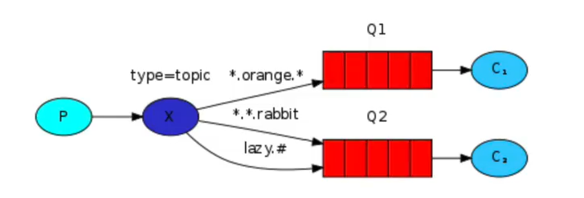

可以做一个通配符匹配：

- \* (star) can substitute for exactly one word.
- \# (hash) can substitute for zero or more words.

 与上述差不多：

```java
channel.queueBind(queue,"topic","user.#");
```

