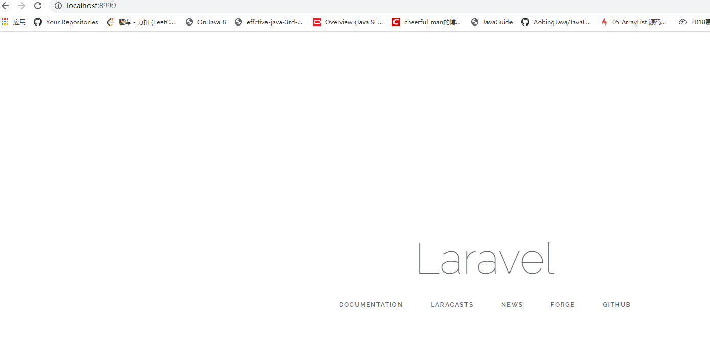
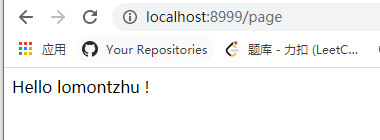
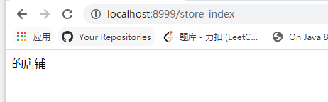
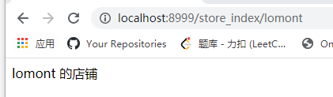
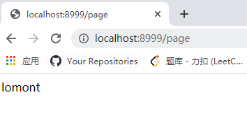
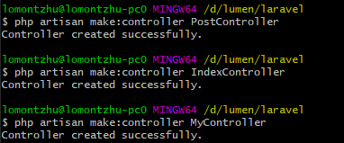
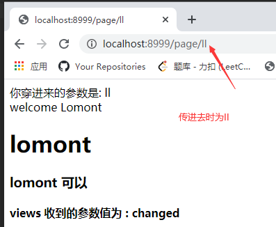

## lumen

### 安装

- PHP >= 7.0.0
- OpenSSL PHP Extension
- PDO PHP Extension
- Mbstring PHP Extension
- Tokenizer PHP Extension
- XML PHP Extension

当你安装好`composer`后，可以使用`composer`安装；

在你要安装的文件下，用`cmd`下面命令安装；

```cmd
composer create-project --prefer-dist laravel/laravel laravel 5.5.*
```


此时我D盘中多了个`laravel`文件；

然后使用下面命令即可监听8999端口号，此时你去浏览器访问localhost:8999如下图则成功

```cmd
php -S localhost:8999 -t public
```




### 目录介绍

1. app: 应用核心代码
2. bootstrap: 少许文件 --> 用于框架的启动和自动载入配置
3. config:应用的所有配置文件
4. database: 包含数据库迁移文件及填充文件
5. public: 应用入口文件，前端资源文件：图片，js，css
6. resources: 视图文件(前端展示文件)；
7. routes：路由目录 ---> 包含应用定义的所有路由
8. storage: 编译后的blade模板，session，文件缓存
9. test:自动化测试文件
10. Vender: 第三方类库,通过composer加载的依赖

### 路由

lumen怎么起来的，为什么在页面上输入url参数可以显示，这就要看到我们的路由了；

在`routes`目录下的`web.php`；假设我添加下面代码

```php
Route::get('/page',function (){
    return "Hello lomontzhu !";
});
```

意思是：通过get请求，访问/page页面，然后执行闭包含函数；

则页面显示为:

可选册数

**路由可选参数**

在后面添加`/{name}`则表示参数，`/{name?}`添加?后表示可选参数，url中可以不输入`name`的值，默认为`$name = ""` (空字符串)

```php
Route::get('/store_index/{name?}',function ($name = ""){
    return "$name 的店铺";
});
```

不添加name参数则：



添加name = lomont后：



### 控制器

当你在路由中：

```php
Route::get('page', 'PageController@index');
@index表示是PageController下的index方法；
一般要加命名空间
```

则当你访问/page时，就会调用index()方法；



### artisan

我们可以通过artisan快速创建Controller

```txt
php artisan make:controller name
```




则


### 向视图中传递变量

`route`控制`url`路径 ---> `controller` ---->  `views`中

我们可以看到初始的`web.php`中有代码：

```php
Route::get('/', function () {
    return view('welcome');
});
通过view()方法直接返回welcom.blade.php；
```

而我们先到`controller`对相应的数据进行处理；

比如我们的`router`:

```php
Route::get('/page/{name}', 'PageController@index');
```

定位到的`controller`:

```php
class PageController extends Controller{
    public function index($name1){
        print "你传进来的参数是: " . $name1 . "<br>";
        $name1 = "changed";
        // 自己定义的参数
        $name = "lomont";
        return view('post/index')->with('name', $name)->with('name1',$name1);
   
```

通过`with()`方法可以将`url`传进来的参数`name1`在`controller`层中修改后再返回给`view()`;

```php
<?php
echo "welcome Lomont";
?>
<!doctype html>
<html lang="en">

<body>
<h1>{{ $name }}</h1>
<h3>{{$name}} 可以</h3>
<h4>views 收到的参数值为 : {{$name1}}</h4>
</body>
</html>
```



---

另一种传参方式： 通过[]也可以

```php
class PageController extends Controller{
    public function index($name1){

        print "你穿进来的参数是: " . $name1 . "<br>";
        $name1 = "changed";
        // 自己定义的参数
        $name = "lomont";
        return view('post/index',["name" => $name])->with('name1',$name1);
    }
}
```

与上面controller代码结果一样；

### 小结

+ 可以通过->with()传参
+ 也可以view('  ', [])传参