## composer命令

### composer使用

随便找一个文件使用`composer init`命令，它会初始化一个`composer.json`文件

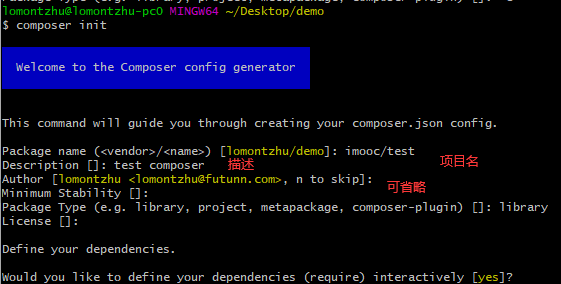

`composer search XXX`：查询某个依赖或者框架什么的

`composer show --all xxx` ： 使用上面命令之后，可以查看其所有版本以及其它信息

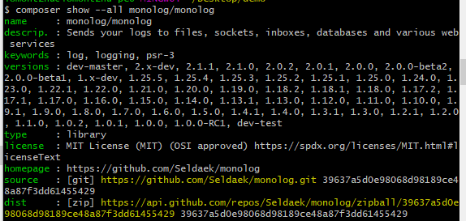

然后我们可以在`composer.json` **require**里面添加**xxx: 版本**，然后使用**composer install** 及可以安装此依赖；

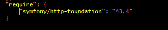

如果要删除依赖，可以直接在require中删除该行，然后使用`composer update`命令即可；

我们也可以直接使用composer require xxx 来添加某个依赖，并且composer会自动把 xxx 所依赖的 依赖也下载下来；

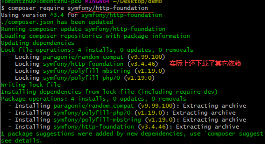

### 使用composer 安装Laravel

通过`composer search laravel`查看该名字：

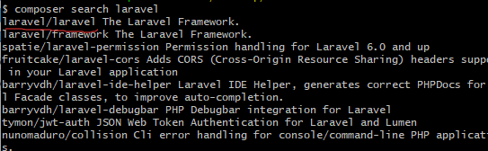

`composer show --all laravel/laravel`：查看版本号

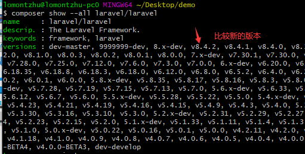

去官网查看安装命令：https://laravel.com/docs/8.x

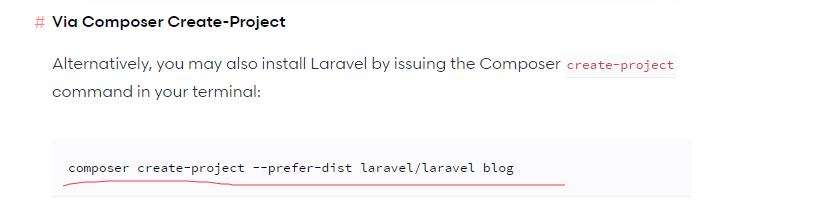

```php
composer create-project --prefer-dist laravel/laravel blog
```

在我本机使用的是：`composer create-project --prefer-dist laravel/laravel laravel8.4.2`

最后的`blog`为名字，故我改成了`laravel8.4.2`,则在我的文件夹中创建了一个叫`laravel8.4.2`的项目

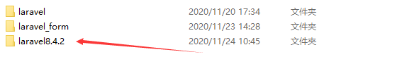

在`laravel8.4.2`文件下，使用下面命令监听8999端口，此时在浏览器中输入：http://localhost:8999/即可访问成功

```php
php -S localhost:8999 -t public
```

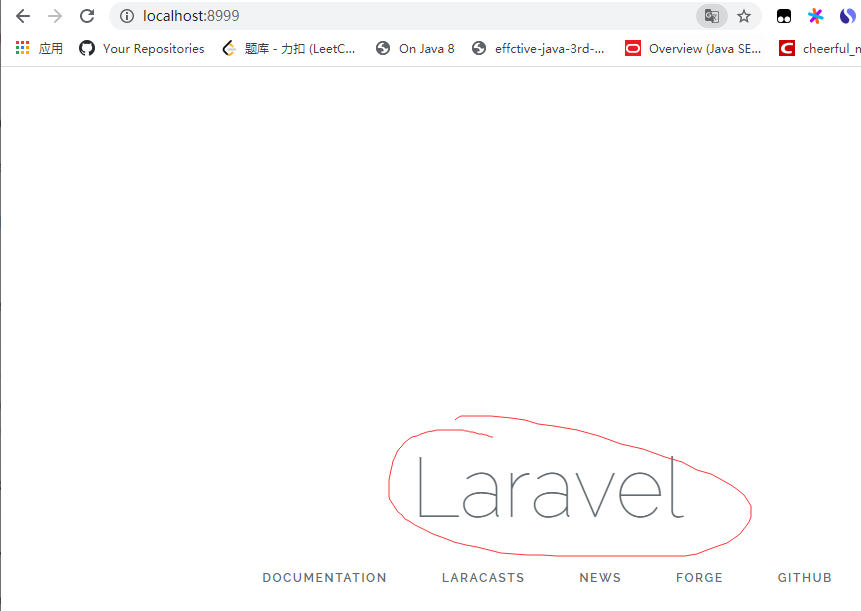

**第二种方法**：

通过安装器安装，则需先下载一个安装器：

```php
composer global require laravel/installer
```

然后将其配置到环境变量：

- macOS: `$HOME/.composer/vendor/bin`
- Windows: `%USERPROFILE%\AppData\Roaming\Composer\vendor\bin`
- GNU / Linux Distributions: `$HOME/.config/composer/vendor/bin` or `$HOME/.composer/vendor/bin`

配置完后在命令行中输入`laravel`出现版本号即代表安装成功：

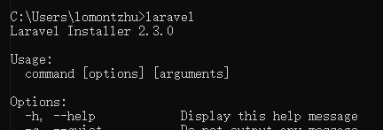

然后通过`laravel new blog`即可

### Artisan

+ 查看可用的Artisan命令：
  + `php artisan`
  + `php artisan list`

+ 具体的帮助信息：
  + `php artisan help migrate`

+ 创建控制器
  + `php artisan make:controller StudentController`
+ 创建模型
  + `php artisan make:model Student`
+ 创建中间件
  + `php artisan make:middleware Activity`

---

通过：`php artisan make:controller StudentController`创建了一个控制器

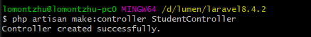

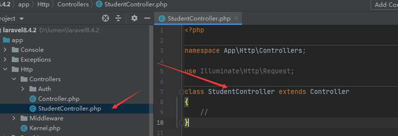

通过`php artisan make:model Student` 创建模型：

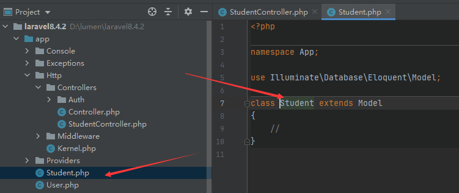

创建中间件：`php artisan make:middleware Activity`


#### 用户认证Auth

通过这个命令`php artisan make:auth`我可以看到`web.php`中多了个路由

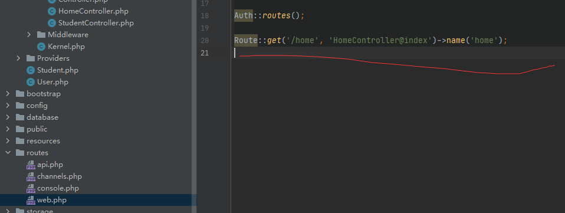

访问`home`后可以看到：已经帮我们写好了登录相关的代码

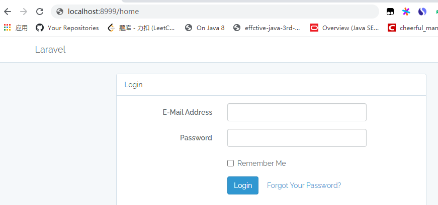

可以在此路径下查看`auth()`信息：

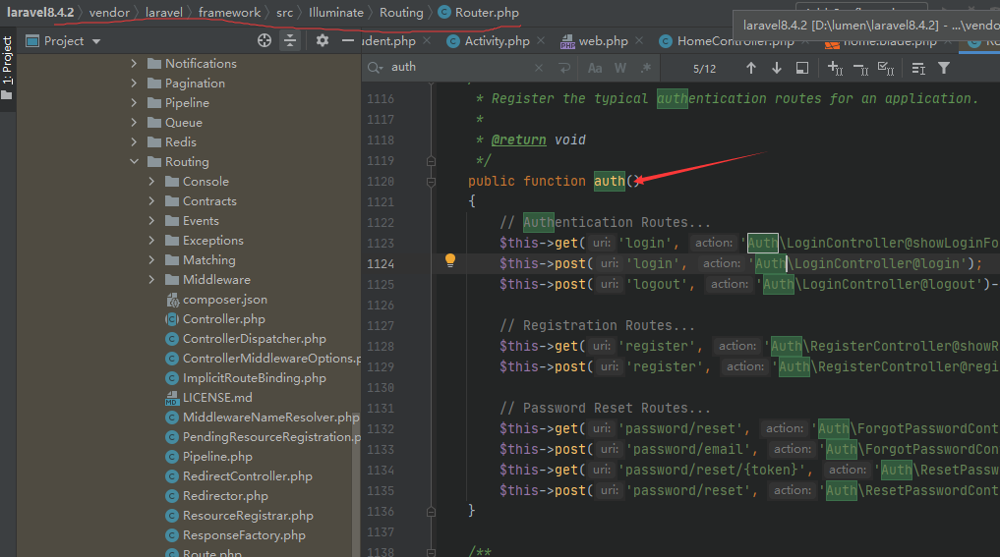

此时如果我们创建用户肯定是无效，因为我们还没连接数据库也没有创建对应的表，我们在`.env`中修改数据库配置信息后，再通过`php artisan migrate`创建数据库表即可：

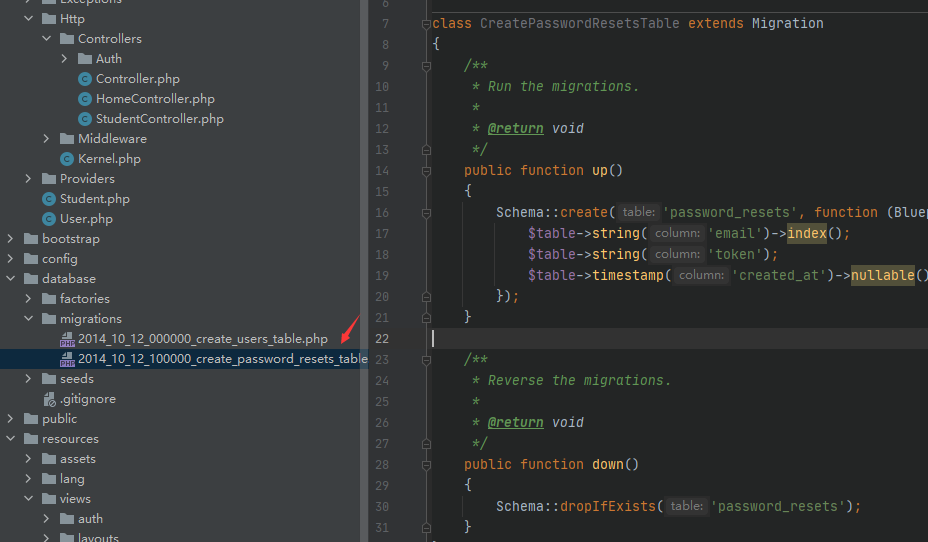

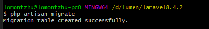

此时创建用户则在数据库中可以看见新增了一条记录：

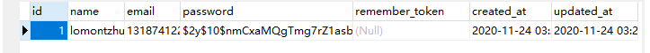

#### 新建迁移文件

+ 新建students表的迁移文件
  + `php artisan make:migration create_students_table`,--table和--create参数用来指定数据表名称，以及迁移文件是否要建立新的数据表。
+ 生成模型的同时生产迁移文件
  + `php artison make:model Student -m`

创建迁移文件：

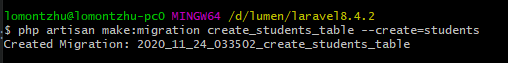

在创建Model时就创建迁移文件：

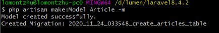

我们可以看到，多了`students`和`article`的俩个迁移文件和一个`Model`

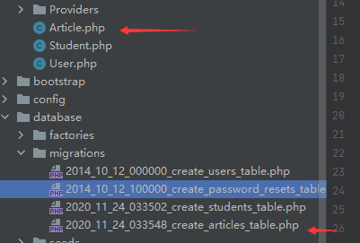

通过修改创建的students迁移文件：

```php
public function up()
{
    Schema::create('students', function (Blueprint $table) {
        $table->increments('id'); // 主键id自增
        $table->string('name'); // 字符串形式的name
        $table->integer('age')->unsigned()->default(0); // unsigned int age默认0
        $table->integer('sex')->unsigned()->default(1); // unsigned int age默认0
        $table->integer('created_at')->default(0); // created_at 默认 0
        $table->integer('updated_at')->default(0); // updated_at 默认 0
    });
}
```

然后再执行`php artisan migrate`则会创建这样的`students`表

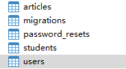

### 上传文件

**前端代码**： `name='source'`,`type = 'file'`，**enctype="multipart/form-data"**很重要

```html
<div class="panel-body">
    <form class="form-horizontal" method="POST" action="" enctype="multipart/form-data">
        {{ csrf_field() }}
        <div class="form-group{{ $errors->has('password') ? ' has-error' : '' }}">
            <label for="file" class="col-md-4 control-label">select file</label>
            <div class="col-md-6">
                <input id="file" type="file" class="form-control" name="source" required>
            </div>
        </div>
        <div class="form-group">
            <div class="col-md-8 col-md-offset-4">
                <button type="submit" class="btn btn-primary">
                    confirm upload
                </button>

            </div>
        </div>
    </form>
</div>
```

**controller:**

```php
public function upload(Request $request){
    if($request->isMethod('POST')){

        $file = $request->file('source');

        // 文件是否上传成功
        if($file->isValid()){
            // 原文件名
            $originalName = $file->getClientOriginalName();
            // 扩展名
            $extName = $file->getClientOriginalExtension();
            // MimeType
            $type = $file->getClientMimeType();
            // 临时绝对路径
            $realPath = $file->getRealPath();

            $filename = date('Y-m-d-H-i-s').'-'.uniqid().'.'.$extName;
            $bool = Storage::disk('uploads')->put($filename,file_get_contents($realPath));
            var_dump($bool);
        }
        var_dump($file);
    }
    return view('student.upload');
}
```

### 发送邮件

首先开启qq邮箱的smtp服务

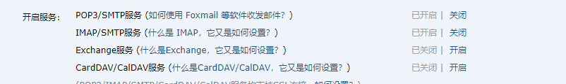

然后配置.env的mail参数：

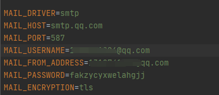

587对应tls，465对应ssl；

然后使用Mail:send即可：

```php
public function mail(){
    //        Mail::raw('邮件内容',function ($message) {
    //            $message->from('xxxx@qq.vom','CheerJia');
    //            $message->subject('主题');
    //            $message->to('xxx75@qq.com');
    //        });

    Mail::send('student.mail',['name'=>'CheerJia'],function ($message){
        $message->to('xxx575@qq.com');
    });
    echo "成功发送！";
}
```

