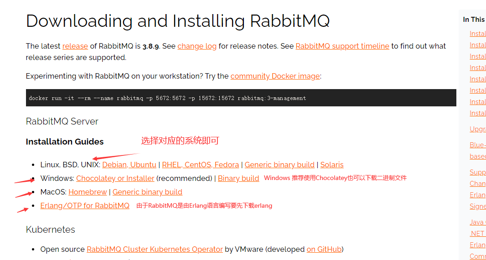
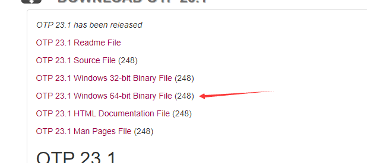
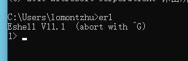
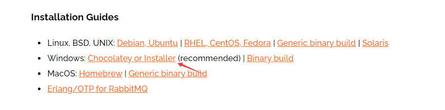
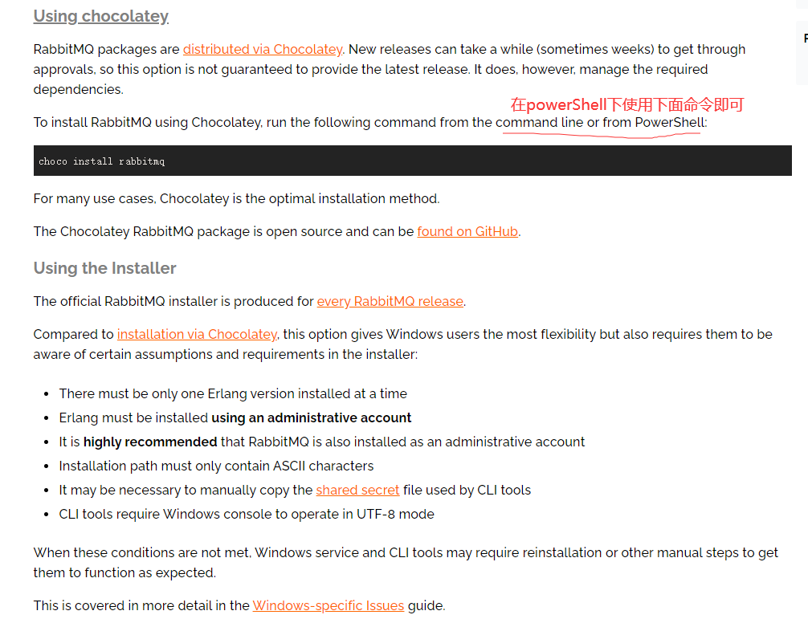
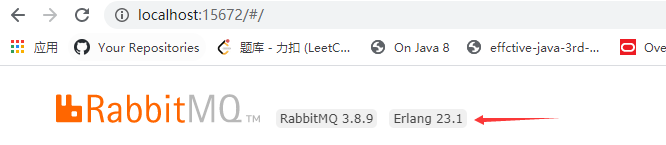

## RabbitMQ安装

**安装当然从官网的Get Started开始**https://www.rabbitmq.com/download.html



erlang:https://www.erlang.org/downloads



下载后，一步步安装即可：


安装后配置环境变量；

```txt
变量名：ERLANG_HOME
变量值：D:\envoriment\erlang\erl-23.1

然后在path上添加 %ERLANG_HOME%\bin 即可
```

最后在cmd中输入erl查看erlang是否安装完成：



接下来就可以愉快的安装**rbbitmq**了

点击进入巧克力安装 （**官方推荐Windows下安装方式**）



在`powershell` 下 通过`choco install rabbitmq`即可（**管理员身份运行** **管理员身份运行** **管理员身份运行** **重要的事情说三遍**）



接下来启动rabbitmq server start即可，然后去`localhost:15672` 登录即可

账号密码都是：guest



如此RabbitMQ就安装完成啦；