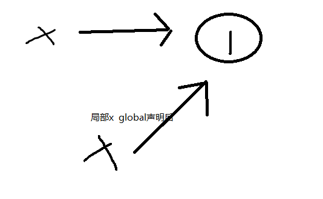
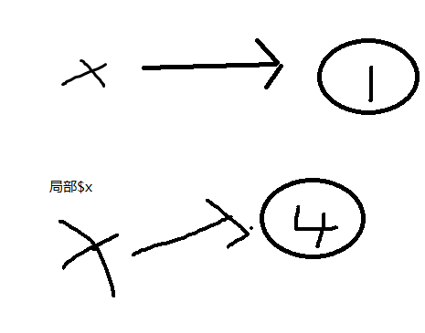

## global

如果我们在外部声明了一个全局变量，我们想在内部修改，可以通过global关键字来实现；

> 一个局部变量在函数结束后，自动销毁，如果你想要局部变量到其他的函数中使用，可以使用return 将它带到其他程序块

```php
<?php
$x = 3;
function test($x){
    $x = 4; // 不行
}
test($x);
echo $x;
?>
    
输出：
3
```

> global 当我们在函数内想用全局变量时，必须用global声明，或者&；

```php
<?php
$x = 3;
// 通过&
function test(&$x){
    $x = 4;
}
test($x);
echo $x;
?>
    
    
<?php
$x = 3;
function test(){
    global $x;
    $x = 4;
}
test();
echo $x;
?>

    
输出：
4
```

> 也可以用$GLOBALS 超全局变量

```php
<?php
$x = 3; // 全局变量，即$GLOBALS['x'] = '3'
function test(){
    global $x;  // 全局变量的引用，$x = &$GLOBALS['x']
    $x = 4;
}
test(); 
echo $x;
?>
```

> 比如我们结合unset()一起看

```php
<?php
$x = 3; // 全局变量，即$GLOBALS['x'] = '3'
function test(){
    global $x;  // 全局变量的引用，$x = &$GLOBALS['x']
    $x = 4;
    unset($x);
}
test();
echo $x;
?>
输出：
4
```

```php
<?php
$x = 3; // 全局变量，即$GLOBALS['x'] = '3'
function test(){
    global $x;  // 全局变量的引用，$x = &$GLOBALS['x']
    unset($x);
    $x = 4;
}
test();
echo $x;
?>
输出：
3
```




而第二个示例在$x = 4之前就unset()了所以我认为是，此时局部$x指向了新的区域，全局$x值并没有修改所以输出3；



```php
<?php
$x = 3; // 全局变量，即$GLOBALS['x'] = '3'
function test(){
    global $x;  // 全局变量的引用，$x = &$GLOBALS['x']
    unset($GLOBALS['x']);
    $x = 4;
}
test();
echo $x;
?>
输出：
报错：Undefined variable: x 
```

全局变量销毁了，引用也销毁了；故报错：Undefined variable: x 

> 目前理解unset()只是断开了 引用和 变量 之间的绑定
>
> 如果被断开，引用计数器减一，最后发现是个无用内存，则会被回收

**以上推断很有可能有错误，第一次学php只是方便自己理解暂时记忆mark，欢迎指出错误；**

关于php的引用文章：https://www.cnblogs.com/happyframework/p/3254007.html