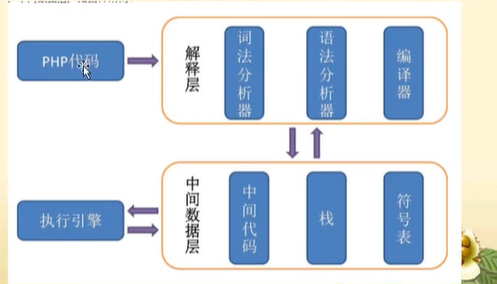
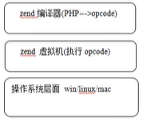
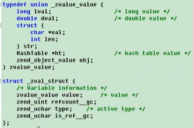
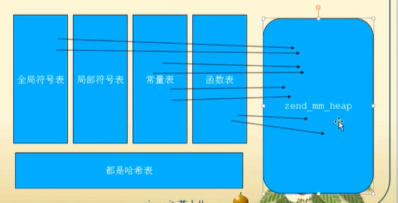

## php运行原理



php -- 编译后 -- opcode文件由zend虚拟机运行；



每次php脚本执行结束后，opcode就被清除；

### php变量如何实现？

众所周知php是弱类型语言，c是强类型语言。

> 那么php是如何通过c实现的？

我们看到**zend.h**源码；



主要是通过**zavl_struct** + **zvalue_zvalue** union实现

比如我们设置`$x = 3;`则底层实现为：

```txt
zvalue_value = 3;
type = is_long
refcount_gc = 1; 
is_ref_gc = 0; // 相当于引用计数器
zavl_struct 结构体中的这两个变量表示是一个long 型，值为3；
type 则是枚举了php 中的八种数据类型
```

`$b = "hello";`

```txt
zvalue_value = {val = 'hello',len = 5}
type = is_string
refcount_gc = 1;
is_ref_gc = 0;
```

变量名则通过**HashTable** 放入全局符号表中， **key = b(变量名); value = 地址;**

当$x = 1,$y = $x时：

```txt
最开始 &$x = &$y
只有当某个变量更改值时 : $x = 2;
则 &$x != &$y
说明更改值时，才会开辟一个新的空间赋值；
```

> php强大的HashTable




### php核心框架


1. Sapi: 使php与外围交互，全称是Server Application Programming Interface服务端应用编程接口
2. zend引擎： 实现了HashTable等基础数据结构，内存分配和管理等核心功能
3. Extensions: 一些标准库

### 执行流程

+ `scanning` : `php` 转化为 语言片段(`Tokens`)
+ `Parsing` : 将`Tokens`转化为简单的表达式
+ 将表达式编译成`Opcode`
+ `Execution` : 执行`Opcode`