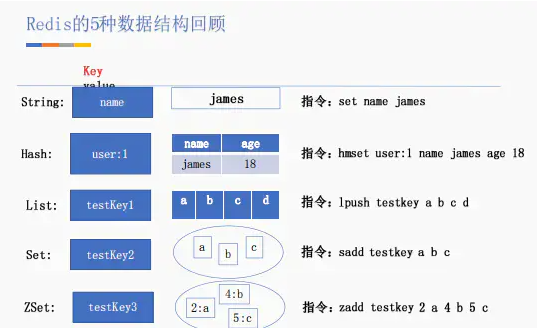
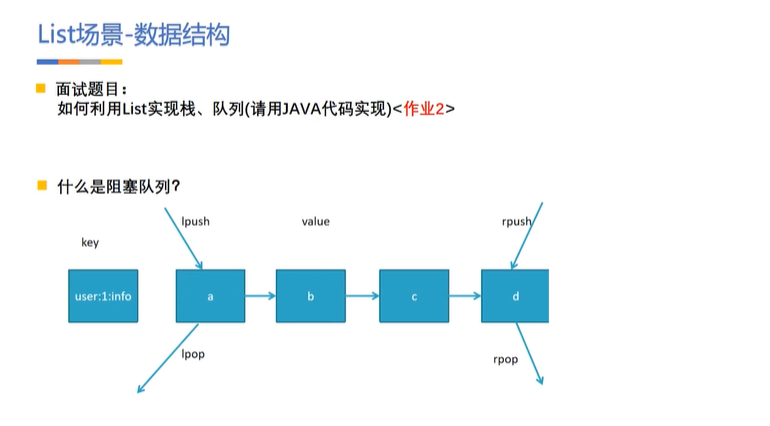
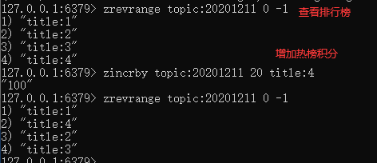
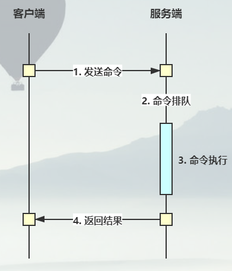

## Redis

Redis是分布式系统中的重要组件，主要是解决高并发、大数据场景下、热点数据访问性能问题，提高高性能快速访问的。

当项目中部分数据比较频繁，对下游DB造成较大的服务器压力时，可以使用缓存提高效率。

**官方话语**：支持10W+的并发

## 常用的数据结构指令



## 场景分析

### string存储


**场景一：商品库存数**

一般来说，商品库存数是一个热点数据，交易行为会直接影响库存。而Redis自身String提供了：

`set goods_03 10` 设置id为3的商品库存为10；

`decr goods_03` 扣减库存

**场景二：时效信息存储**

Redis做缓存有一个最大的优点 ----  可以设置失效时间 expireTime；

比如获取登录验证码，设置验证码有效时间在5分钟等；

**场景三：分布式锁**

利用setnx可以添加分布式锁；


简单分布式锁逻辑：

```php
if(setnx lock:1 == true){
    获得该锁，正常执行业务
    ....
}else 阻塞
del lock:1  逻辑完成后释放锁
```

> 当异常导致程序结束无法释放锁怎么办呢？
>
> 这样会导致该业务用于无法执行 --- 锁为删除 永远获得不了锁

很简单异常的情况大家肯定可以想到用try finally

```php
try{
    if(setnx lock:1 == true){
    	获得该锁，正常执行业务
    	....
	}else 阻塞
}finally{
    del lock:1  逻辑完成后释放锁
}
```

> 如果并不是因为业务而是因为其他情况挂了呢？
>
> 比如运维在 kill -9
>
> 这样会导致该业务用于无法执行 --- 锁为删除 永远获得不了锁

相信大家一眼都看出来了，该锁没有加过期时间；

```php
try{
    if(setnx lock:1 20 value == true){
    	获得该锁，正常执行业务
    	....
	}else 阻塞
}finally{
    del lock:1  逻辑完成后释放锁
}
```

过期时间：


至少过期之后，别人也可以进来加锁；

> 此操作可以满足低并发场景

**问题：**极端情况下：**等于无锁**   ---  原因：自己的锁被别人释放

增加身份的判断：

```php
uuid = UUID.randomUUID().tostring()
try{
    if(setnx lock:1 20 uuid == true){
    	获得该锁，正常执行业务
    	....
	}else 阻塞
}finally{
    if(uuid == get lock:1)
    del lock:1  逻辑完成后释放锁
}
mark
```

> 如果一个请求执行60s，你过期时间为20s，那岂不是还没执行完就自动消失了？

解决：可以另开一个线程定时对其进行检测主线程是否还持有该锁，如果还持有则将其更新到20s;   **比如每5s 检测一次，如果还持有则更新为20s；**

> 上述也就是一般框架里面的实现方式
>
> 但是在redis集群中redis还是存在失效问题

比如主机`redis`有锁，还未同步到从机redis时宕机，而后该从机升为主机则仍能加锁,也是会出现同一资源被多个client加锁的。；

对应解决方案：     `zp`强一致性实现分布式锁

`redlock` ----  红锁：

1. 获取当前时间戳，单位是毫秒；
2. 跟上面类似，轮流尝试在每个master节点上创建锁，过期时间较短，一般就几十毫秒；
3. 尝试在大多数节点上建立一个锁，比如5个节点就要求是3个节点（n / 2 +1）；
4. 客户端计算建立好锁的时间，如果建立锁的时间小于超时时间，就算建立成功了；
5. 要是锁建立失败了，那么就依次删除这个锁；
6. 只要别人建立了一把分布式锁，你就得不断轮询去尝试获取锁。

问题： redis本来性能很高，而使用红锁降低了性能，redis优点就在性能

zk 强一致性分布式锁:

1. 某个节点创建znode，创建成功获取该锁
2. 其它客户端要获取则会失败只能监听该锁znode
3. 当宕机时，则删除该znode并通知其它客户端


### hash存储数据


可以用HASH存储对象：{name : lomont, age : 18， sex: 男}

**场景一：购物车**

功能：

+ **全选**：一键获取该用户所有商品
+ **商品数量**：购物车图标上显示购物车数量
+ **删除**：移除购物车里的某个商品
+ **增加**：增加或减少某个商品的数量

比如该用户userID : 003

`hmset cart:003 goods:01 1 goods:03 3`

用户ID为KEY,商品ID为Field，加入购物车数量为value

**获取商品数量** ： `hlen cart:001`

**获取全部商品：**`hgetall cart:003`

**增加商品数量：** `hincrby cart:003 goods:01 1`


#### **实现信息存储的优缺点**

##### 原生: 

- set user: 1:name 	james;
- set user:1:age        23;
- set user:1:sex        boy;

**优点:**简单直观，每个键对应一个值

**缺点:**键数过多，占用内存多，用户信息过于分散，不用于生产环境

##### **将对象序列化存入**

redis set user:1 serial ize (userInfo);

**优点:**编程简单，若使用序列化合理内存使用率高

**缺点:**序列化与反序列化有一定开销，更新属性时需要把userInfo全取出来进行反序列化，更新后再序列化到redis

##### **hash存储:**

hmset user:1 name james age 23 sex boy

增加年龄：`hincrby user:1 age 2`

修改姓名：`hset user:1 name lomont`

**优点:**简单直观，使用合理可减少内存空间消耗

### List使用场景

****

可以通过`brpop`实现阻塞队列

**场景一：最新上架商品**

比如对新上架的产品进行推荐模块，这个模块存储新上架的前50名；

因为 list 结构的数据查询两端附近的数据性能非常好，可以使用list来进行top 50，`ltrim` 指令对一个列表进行修剪（trim）；

**场景二：一对多分析**


**一个用户订阅了多个订阅号**：当一个一个订阅号发送了一个消息给用户时，`lpush mes:uId 100 101 102`

执行`lrange mes:uId 0  -1` 查出所有消息ID 通过**异步**的方式加载图片等信息

**场景三：分页**

比如博客文章中使用`lrange`进行快速分页，当你下拉时，进行不断的分页；

### set使用场景

set提供去重的功能，要求列表里面元素不重复，并且提供交集、并集、差集。

**场景一：抽奖活动**


一个用户参加一次，每有一个用户就放入set: **sadd act:001 u01 u02 u03 u04 u05**


**场景二：利用交集差集等**

比如QQ的共同好友，可能认识的人 --- 或者推荐系统等

### Zset集合

常用于排行榜，如视频网站需要对用户上传视频做排行榜，或点赞数与集合有联系，不能有重复的成员


**场景一：排行榜系统**


日期作为key，如 `topic:20201211` ,




### BitMap

位图，支持用bit位来存储信息，可以用来实现**布隆过滤器（BloomFilter）**；

**场景一：登录在线**

上亿用户的去重登录打卡统计，查询某用户是否在线；

### 批量操作

redis命令执行过程



每个 redis 命令的执行都分为以下四个步骤：

1. 发送命令
2. 命令排队
3. 命令执行
4. 返回结果

这是一个典型的tcp交互方式，其中客户端一次IO的花销有：

+ Scoket IO上下文切换开销
  + read／write
+ 指令执行开销
  + Redis采用C实现，使用了轻量级的hash表、skipList跳表等数据结构实现了高效的缓存，故IO开销更加无法忽略
+ （高并发）资源竞争和系统调度开销
  + 多个线程对连接池进行激烈的竞争，上下文切换频繁

减少客户端与服务端的交互来进行性能提升

#### 批量命令

- `mget` (适用于string类型)
- `mset` (适用于string类型)
- `hmget` (适用于hash类型)
- `hmset` (适用于hash类型)

**严格来说是一个指令中处理多个key**

单机上：

+ 优势： 单条指令操作，性能略高于其它批量操作指令。

集群上：

+ mget 与 mset 无法保证所有的 key 均散落在同一个服务器上，而一旦出现用于通信的目标服务器与实际存储对应 key 的服务器不同的情况时，redis 服务器会返回 MOVED 转向从而让客户端重新发起请求

**Redis的批量操作-管道（pipeline）**

Redis客户端为了减少网络交互而提供的一种功能。**pipeline**主要就是将多个请求合并，进行一次提交给Redis服务器，Redis服务器将所有请求处理完成之后，再一次性返回给客户端。各个命令之间不能有数据依赖，因为 pipeline 执行命令式不能保证执行顺序与写入时的命令顺序相同。

**缺点**

- 没有任何事务保证，其他client的命令可能会在本pipeline的中间被执行。
- 因为pipeline是独占连接的，如果管道内命令太多，可能会造成请求超时
- 可发送命令数量受到客户端缓冲区大小限制，如超过限制，则flush到redis
- **当某个命令的执行需要依赖前一个命令的返回结果时，无法使用pipeline。**

在Redis集群模式下提供Pipeline批量操作的功能。**基本思路就是根据redis cluster对数据哈希取模的算法，先计算数据存放的slot位置, 然后根据不同的节点将数据分成多批，对不同批的数据进行单点pipeline处理。**

### 总结

1. 缓存：合理的利用缓存不仅能够提升网站访问速度，还能大大降低数据库的压力。Redis提供了键过期功能，也提供了灵活的键淘汰策略；
2. 排行榜 --- zset
3. 计数器 ： 高访问量的网站每次浏览都要对商品，浏览量等+1，如果每次都请求数据库肯定压力很大，通过Redis的incrby实现基于内存操作性能很好
6. 社交网络：点赞，共同爱好，好友等  ---  set
7. 最新列表 :  list
6. 分布式会话
7. 分布式锁

