### Cloud Base

云开发（Tencent CloudBase，TCB）是云原生一体化**开发环境**和**工具平台**

避免了应用开发过程中**繁琐**的**服务器搭建及运维**，开发者可以专注于**业务逻辑**的实现，开发门槛更低，效率更高

>  云开发 ==  慢慢干掉运维？

主要的就是一体化开发环境 -- 开发者无需购买数据库、存储等基础设施服务，无需搭建服务器即可使用。

### Serverless 是什么？

**一站式服务**：从初始化、编码、调试、资源配置和部署发布，到业务监控告警、故障排查的一站式解决方案

Serverless Framework 是一个 标准化、组件化 的 Serverless 应用开发产品，如下图所示：


### 产品功能

#### 应用级框架

Serverless Framework 提供贴合应用场景的框架，开发者根据实际需求选择对应框架后，只需专注于业务逻辑的开发，无需关注底层资源。

#### 便捷部署

开发者部署应用时，Serverless Framework 会根据应用特性，自动完成云函数、API 网关、COS 等基础资源的部署和配置，无需再手动部署配置每一项基础资源。

#### 一站式体验

通过 Serverless Framework，您可以快速创建 Serverless 应用，并完成应用的调试和部署，监控已发布应用运行状态并快速排障。

### 部署serverless应用

首先在windows下使用`chocolatey`安装：`choco install serverless`

通过``serverless -v` 查看是否安装好：

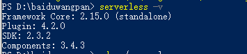

安装之后在文件夹下使用serverless命令，可以部署一个serverless项目：


最后会告诉你一个url:及可以访问：

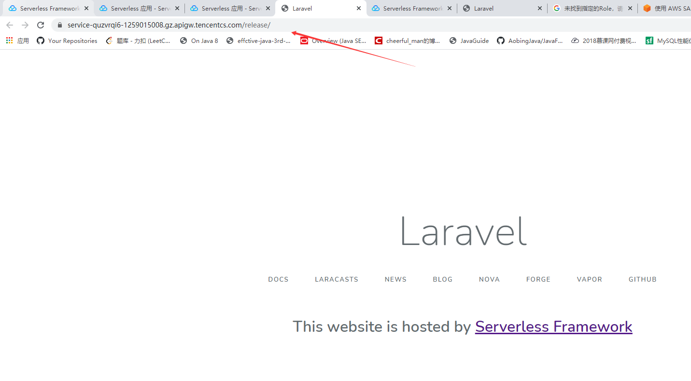

如果你要修改代码：则可以去https://console.cloud.tencent.com/ssr/develop?stageName=dev&appName=laravel-serverless&instanceName=laravel-LFCliNBuF&stageList=dev

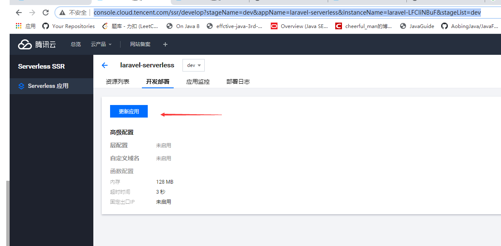

通过更新应用来修改我们的代码，将其下载到本地上，从零开发；

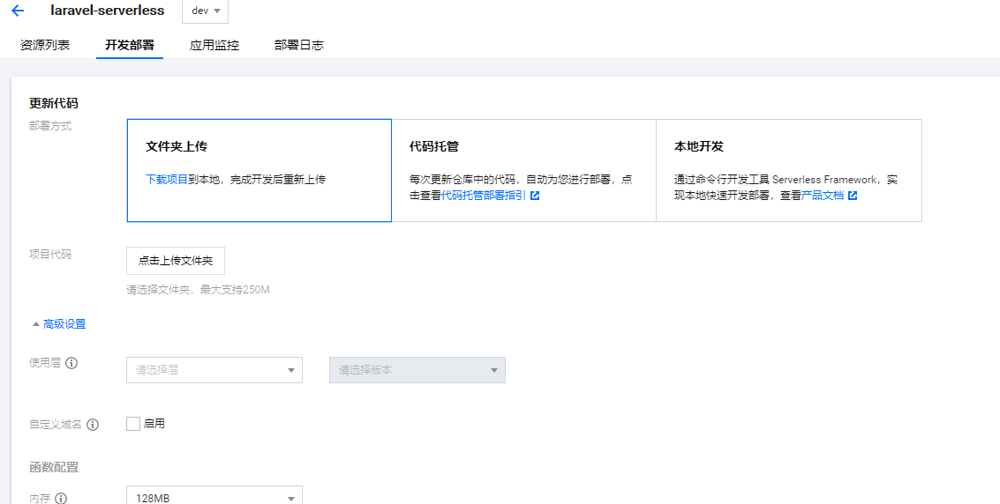


### 从本地部署

当然你也可以从本地部署，但是要修改一些配置：

### 修改Laravel项目:

#### Step 1

修改 bootstrap/app.php 文件，在 $app = new Illuminate\Foundation\Application 后添加

```
$app->useStoragePath(env('APP_STORAGE', '/tmp'));
```

#### Step 2

在根目录下的 .env 文件中新增如下配置:

```
# 视图文件编译路径 
VIEW_COMPILED_PATH=/tmp/storage/framework/views 

# 由于是无服务函数，所以没法存储 session 在硬盘上，如果不需要 sessions，可以使用 array 
# 如果需要你可以将 session 存储到 cookie 或者数据库中 
SESSION_DRIVER=array 

# 建议将错误日志输出到控制台，方便云端去查看 
LOG_CHANNEL=stderr 

# 应用的 storage 目录必须为 /tmp 
APP_STORAGE=/tmp
```

### serverless 云函数

简介：**帮助您在无需购买和管理服务器的情况下运行代码。您只需使用平台支持的语言编写核心代码并设置代码运行的条件，即可在腾讯云基础设施上弹性、安全地运行代码。**

体验入口：https://serverless.cloud.tencent.com/start?c=re 

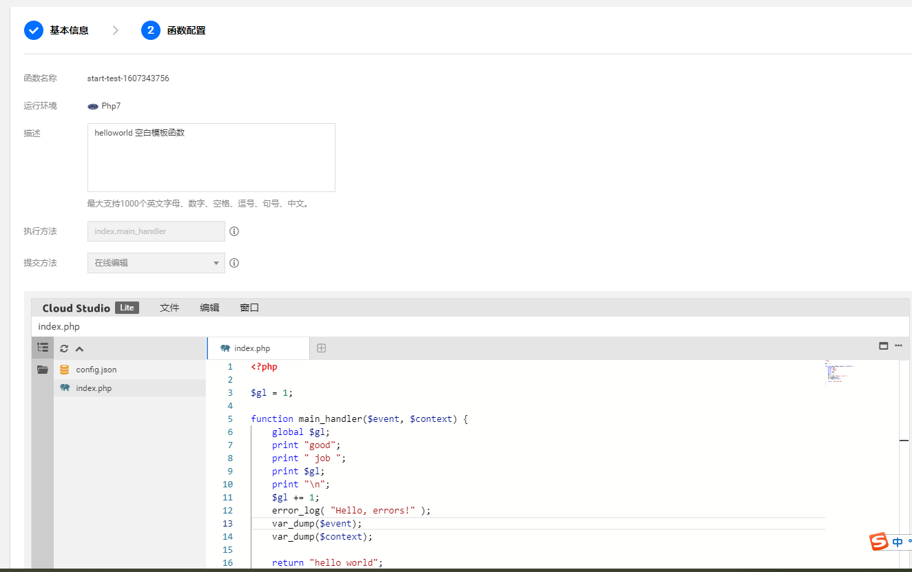

配置完成后可以在线编辑，以及查看监控信息，日志查询等；

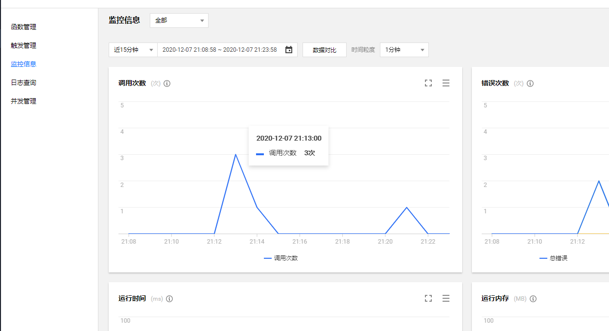

要配置一个**触发器**：

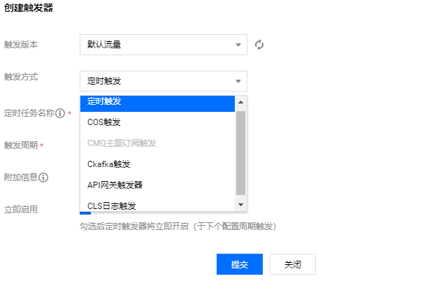

我这里选择的**api网关触发器**会生成一个链接：

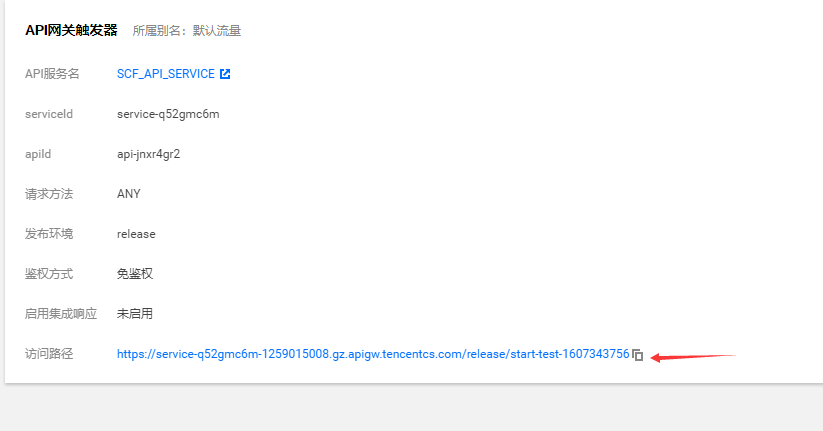

即可访问

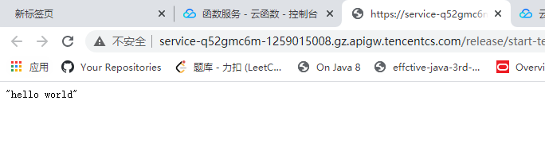

### 计费

有按量计费、包年包月、资源包

**按量**：

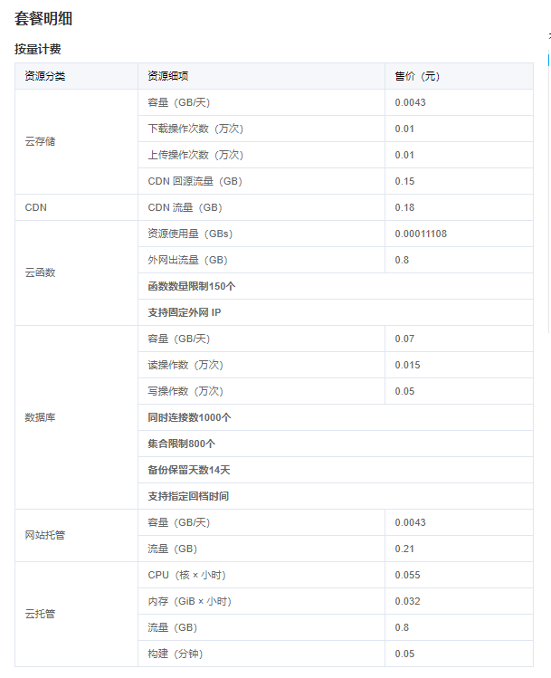

套餐概览：

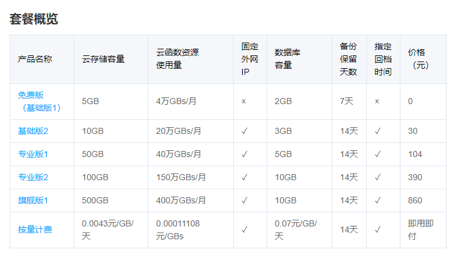