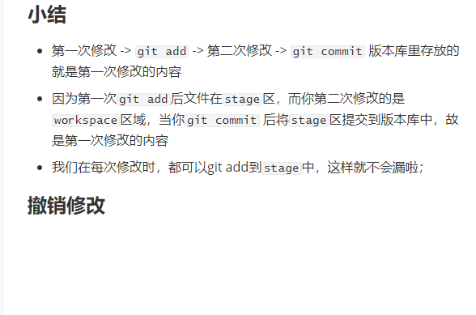
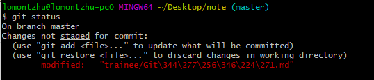
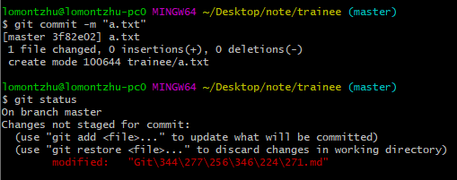
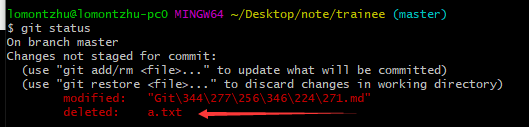
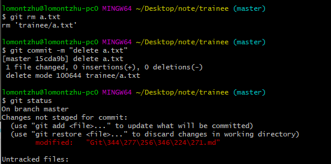
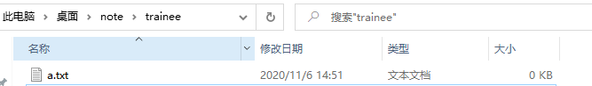

## Git修改

### Git管理修改

**Git新增了暂存区的概念；**

假设我们修改了一个文件：

```text
lomontzhu@lomontzhu-pc0 MINGW64 ~/Desktop/note (master)
$ cat trainee/Git修改.md
## Git修改

Git新增了暂存区的概念：

假设我们修改了一个文件
```

然后添加：

```txt
lomontzhu@lomontzhu-pc0 MINGW64 ~/Desktop/note (master)
$ git status
On branch master
Changes to be committed:
  (use "git restore --staged <file>..." to unstage)
        new file:   "trainee/Git\344\277\256\346\224\271.md"
```

此时文件以及在`stage`区域了如果我们再修改：

```txt
lomontzhu@lomontzhu-pc0 MINGW64 ~/Desktop/note (master)
$ cat trainee/Git修改.md
## Git修改

**Git新增了暂存区的概念；**

假设我们修改了一个文件：

​```text
lomontzhu@lomontzhu-pc0 MINGW64 ~/Desktop/note (master)
$ cat trainee/Git修改.md
## Git修改

Git新增了暂存区的概念：
```

然后提交:

```git
lomontzhu@lomontzhu-pc0 MINGW64 ~/Desktop/note (master)
$ git commit -m "git tracks changes"
[master fc25c50] git tracks changes
 1 file changed, 16 insertions(+)
 create mode 100644 "trainee/Git\344\277\256\346\224\271.md"

lomontzhu@lomontzhu-pc0 MINGW64 ~/Desktop/note (master)
$ git status
On branch master
Changes not staged for commit:
  (use "git add <file>..." to update what will be committed)
  (use "git restore <file>..." to discard changes in working directory)
        modified:   "trainee/Git\344\277\256\346\224\271.md"
```

我们发现`modified:   "trainee/Git\344\277\256\346\224\271.md"`第二次修改没提交上去；

我们可以用`git diff head -- trainee/Git修改.md`查看工作区和版本库里的区别 ---> 发现确实没修改；

#### 小结

+ 第一次修改 -> `git add` -> 第二次修改 -> `git commit` 版本库里存放的就是第一次修改的内容
+ 因为第一次`git add`后文件在`stage`区，而你第二次修改的是`workspace`区域，当你`git commit` 后将`stage`区提交到版本库中，故是第一次修改的内容
+ 我们在每次修改时，都可以git add到`stage`中，这样就不会漏啦；

### 撤销修改

当你修改了一些内容后，比如我现在正在写的这行及以下内容【滑稽】；

使用`git status` 查看状态：`modified:   "trainee/Git\344\277\256\346\224\271.md"`

  做了修改，我们可以通过`git checkout -- file`命令回到版本库中的状态如:`git checkout -- trainee/Git修改.md`

好的已经全部回退了：



故`git checkout -- trainee/Git修改.md`意思就是，把`trainee/Git修改.md`文件在工作区的修改全部撤销，这里有两种情况：

+ **文件**自修改后还没有被放到暂存区，现在，撤销修改就回到和版本库一模一样的状态；
+ **文件**已经添加到暂存区后，又作了修改，现在，撤销修改就回到添加到暂存区后的状态；

**总之，就是让这个文件回到最近一次`git commit`或`git add`时的状态。**

如果你将修改add到暂存区(`stage`)了还没提交，那么你可以用`git reset HEAD <file>`可以把暂存区的修改撤销掉（`unstage`），重新放回工作区：

我们使用`git reset head trainee/Git修改.md`发现：



暂存区的已经撤销(`unstage`)了

`git reset`可以回退版本，也可以把暂存区的修改回退到工作区。`HEAD`表示最新的版本

#### 小结

+ 当你工作区修改后可以使用`git checkout -- file`撤回
+ 当你`add`到`stage`区后要撤回，则使用`git reset head file`

+ 如果你`commit` 到版本库后，可以使用`git reset --hard HEAD^`

### 删除文件

如果你创建了一个新文件并且`commit`到版本库了



此时你把该a.txt删除后：



---

+ 此时你可能**确实要从版本库删除该文件**：`git rm` 然后`git commit`



+ 也有可能是删错了那么直接使用`git checkout -- a.txt`则可以恢复:




> 注意：从来没有被添加到版本库就被删除的文件，是无法恢复的！

#### 小结

当你工作区删除了文件，而版本区有时。

+ 如果你真的想删除可以使用`git rm file`, `git commit -m ""`
+ 而如果你想回复的话就可以使用 `git checkout -- file`,其实这个命令就是用**版本区的版本替换工作区的版本** 如果你没有删除，则变成了撤销修改