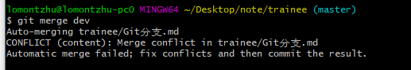
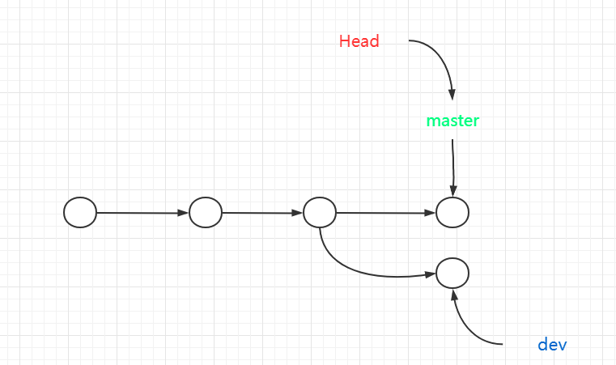
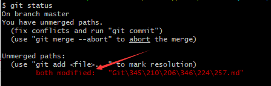
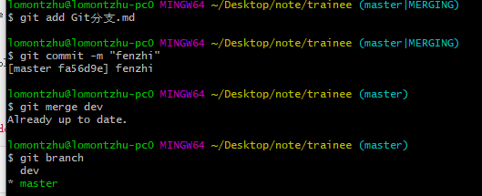
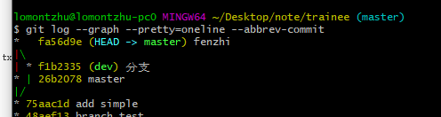
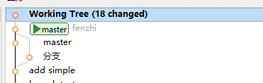

## Git分支管理

### 分支简介

分支在实际中有什么用呢？假设你准备开发一个新功能，但是需要两周才能完成，第一周你写了50%的代码，如果立刻提交，由于代码还没写完，不完整的代码库会导致别人不能干活了。如果等代码全部写完再一次提交，又存在丢失每天进度的巨大风险。

现在有了分支，就不用怕了。你创建了一个属于你自己的分支，别人看不到，还继续在原来的分支上正常工作，而你在自己的分支上干活，想提交就提交，直到开发完毕后，再一次性合并到原来的分支上，这样，既安全，又不影响别人工作。

### 分支操作

首先我们创建分支`dev`

```txt
$ git checkout -b dev
Switched to a new branch 'dev'
```

**此时指针为这样：**

 

> git checkout命令加上-b参数表示创建并切换，相当于以下两条命令：

```txt
$ git branch dev
$ git checkout dev
Switched to branch 'dev'
```

> 可以使用git branch查看当前分支

```txt
$ git branch
* dev
  master
```

列出了所有分支，加*代表当前分支；

现在我们可以在`dev`分支上进行正常操作，比如修改一个文件并且提交：


> 提交之后分支为


然后切换回主分支：


**切换回后，是看不到刚刚提交的文件的，因为此时在`master`上**

然后将`dev`分支和`master`分支合并 使用`git merge dev`


>  从上面我们可以看见`fast-forward`表示这次合并是“快进模式”，也就是直接把`master`指向`dev`的当前提交，所以合并速度非常快。
>
> 合并后分支状态：


接下来可以把dev分支删掉了：`git branch -d dev`


#### 小结

+ 查看分支：`git branch`
+ 创建分支：`git branch <name>`
+ 切换分支：`git checkout <name>`或者`git switch <name>`
+ 创建+切换分支：`git checkout -b <name>`或者`git switch -c <name>`
+ 合并某分支到当前分支：`git merge <name>`
+ 删除分支：`git branch -d <name>`

### 解决冲突

人的一生肯定不是一帆风顺的，我们分支合并的时候肯定也可能会出现问题；

比如我们创建一个分支并且选择它；


比如本文件，就修改了信息；将本文件提交：


切换回原来的分支：修改后然后再提交


此时就是`dev`提交的`Git分支.md`和master提交的`Git分支.md`内容不一样；

我们合并 `git merge dev`：



发现无法快速合并（**不是Fast-forward**）



并且它告诉我们冲突在**Git分支.md**我们必须手动解决冲突；



> git status查看发现说两个都修改了

我们可以把其中修改一下内容，再重新提交，这样就可以合并了：



我们可以用`git log --graph --pretty=oneline --abbrev-commit`查看合并情况：



也可以用smartGit看看：



发现合并完成；

#### 小结

+ 当Git无法合并时，我们可以修改成想要的内容，重新提交合并
+ 我们可以用`Git log --graph`查看合并情况
+ **当一个分支修改头一个分支修改尾巴时不会产生冲突，而两个分支都修改头或者尾巴就会出现分支，而这时候就是让一个分支重新修改提交，则解决**

### 分支管理

我们使用`Fast forward`时，删除分支后，会丢掉分支信息，我们可以通过`--no-ff`方式的`git merge`合并；