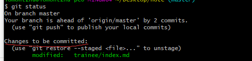

## Git命令初学

### Git和SVN

+ Git是分布式版本控制，每台电脑都有一个完整的版本库
+ Svn是集中式版本控制，版本库集中在中央，每台电脑需要联网，从集中版本库中获得最新版本


### Git基本命令

```text
git add 放入stage区
git commit -m "注释内容，方便寻找版本"  提交到Repository
git status  查看状态
git diff [file1] 查看与Repository有何不同
```

> git status 查看状态

#### git init


#### git add



#### git commit -m "注释"


每一个commit的之后都能找到记录。

我们可以通过git log查看


当然我们可以在git log 后加上参数`--pretty=oneline`这样输出得更漂亮


### 版本回退

上一个版本就是HEAD^，上上一个版本就是HEAD^^，当然往上100个版本写100个^比较容易数不过来，所以写成HEAD~100。

```
$ git reset --hard HEAD^
```

当我们回退到上一个版本之后，就好比我们从今天变成了昨天，但是我又想回到昨天怎么办呢？只要我们暂时没有关闭git窗口,即可根据 commit id回到现在；

```text
git reset --hard f44f
```

#### Git版本回退

Git的版本回退是因为其内部有个HEAD指针；

```ascii
┌────┐
│HEAD│
└────┘
   │
   └──> ○ 新增img
        │
        ○ oh my love
        │
        ○ 新增Git基本命令
改成了
        
┌────┐
│HEAD│
└────┘
   │
   │    ○ 新增img
   │    │
   └──> ○ oh my love
        │
        ○ 新增Git基本命令
```

但是如果你关掉了电脑，第二天想恢复怎么办呢？

嘿嘿！别着急，我们Git总是那么强大，我们可以使用`git reflog`查看我的命令；


是不是马上就知道我们的id是f44f啦！！

#### 回退总结

+ Git回退是由HEAD指针指向的
+ 我们回退之前可以用`git log`查看提交历史`git log --pretty=oneline`可以更美观的查看哦
+ 然后可以根据`git reset --hard HEAD^` 或者^很多次来回退
+ 也可以通过git reflog查看历史命令，通过`git reset --hard commit_id`回退

### 工作区和暂存区

Git和其他版本控制系统如SVN的一个不同之处就是有暂存区的概念。

#### 工作区（workspace）

嘿嘿！工作区`workspace`就是你电脑上看见的目录:


#### 版本库（Repository）

Git的版本库里存了很多东西，其中最重要的就是称为`stage`（或者叫`index`）的暂存区，还有Git为我们自动创建的第一个分支`master`，以及指向`master`的一个指针叫`HEAD`。


我们把自己`workspace`的文件往Git版本库添加时，分为两步：

1. `Git add` 把文件添加到暂存区(`stage`)
2. 用`git commit`提交修改，也就是把`stage`区的所有内容提交到当前分支

我们在创建Git版本库时，Git自动为我们创建了一个唯一`master`分支,其实`git commit`就是往`master`分支上提交更改。

##### 版本库状态

假设你`git add reademe.text LICENSE`，那么版本库会变成这样：


`git add`命令实际上就是把要提交的所有修改放到暂存区（Stage），然后，执行`git commit`就可以一次性把暂存区的所有修改提交到分支。

当你`git commit` 后：


就都提交到分支上了，stage上就干干净净啦!

#### 小结

+ 弄懂刚开始`git init`后的状态
+ git add后会把文件放入`stage`中
+ 当你`git commit` 则会提交到你的分支