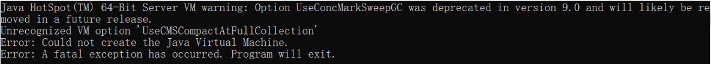
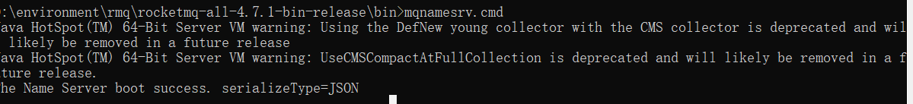

## 原本环境

| 服务           | 版本  |
| -------------- | ----- |
| RocketMQ       | 4.5.1 |
| jdk            | 9+    |
| windows10 64位 | win10 |

## 问题

在start mqnamesrv.cmd 时报错

## 解决

**降低jdk版本**

链接：https://pan.baidu.com/s/1fDP_1mQh4CbHVUiM9YnG_w 
提取码：w9s2

安装后记得更改JAVA_HOME 环境变量即可。

