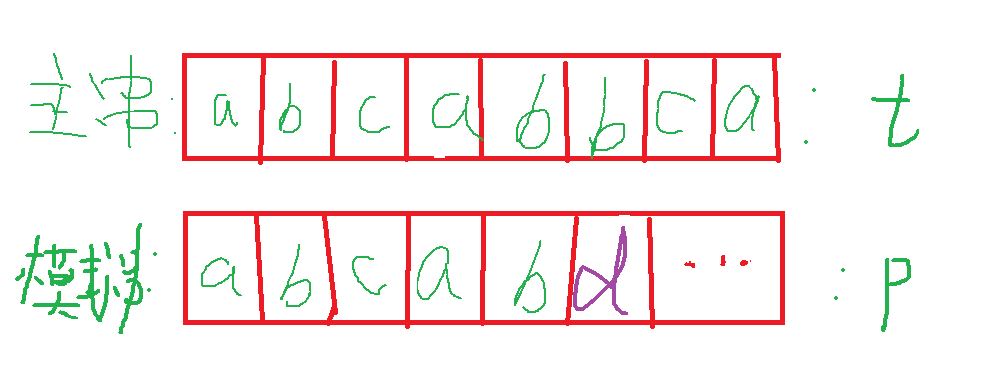
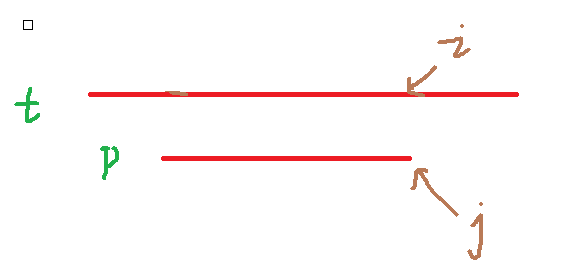
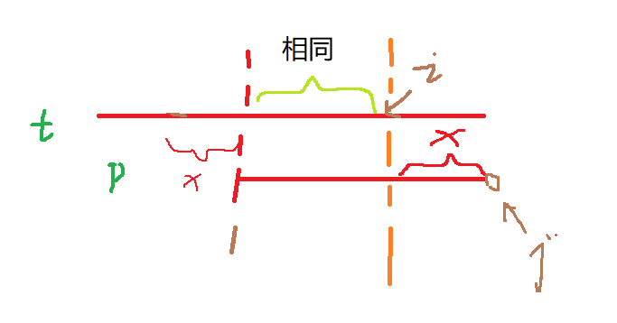
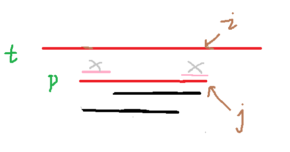
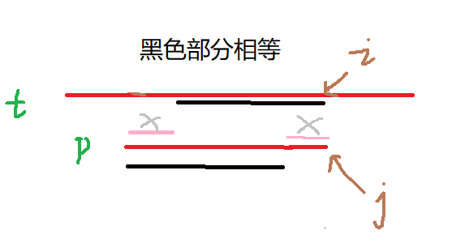

## KMP

一种匹配字符串的算法；

> 当我们要匹配p和t字符串，找到p串在t串中出现的第一个位置的下标；

首先我们想到的就是暴力算法：leetcode:28题https://leetcode-cn.com/problems/implement-strstr/

```java
public int strStr(String t1, String p1) {
    if(p1.equals("")) return 0;

    int n = t1.length(),m = p1.length();
    char[] p = p1.toCharArray(), t = t1.toCharArray();
    for(int i = 0; i <= n - m; i ++){
        for(int j = 0; j < m; j ++){
            if(p[j] != t[i + j])break;
            else if(j == m - 1) return i;
        }
    }
    return 0;
}
```



当此时发现第六个位置d上不同时，上面的代码实现方式则为：

```txt
abcabbca...
abcabd...
往后挪一位
abcabbca...
 abcabd...
```

但是其实我们发现往后挪一位,**a**和**b**也不相同，挪两位 compare(t[2],p[0])也不相同**c**与**a**,直到compare(t[3],p[0]) **a**与**a**才相同

```txt
abcabbca...
   abcabd...
```

要改进暴力算法，我们可以想想暴力算法中，有没有什么**信息是我们没有利用的**，是不是可以通过某个信息，来**提高**匹配**速度**；

**答案**是：有的，当你第**j**个位置不匹配时，**p[0~j - 1]**的字符串和**t[i ~ i + j - 1]** 字符串是相同的；

也就是说：看到我们上面的比较，实际上**t[2]和p[0]比较**就是**p[2]和p[0]比较**，如果p[0] != p[1] 那么 p[0] != t[1]，故如果我们找到一个离p[0]在(0 ~ j - 1)中最近的一个字符串 使得**p[0] = p[x] (0< x <= j -1)**不就加快了速度吗？

```txt
abcabacpasdf
abcabacd
第一失败后
abcabacpasdf
   abcabacd
第二失败后
abcabacpasdf
     abcabacd
发现不匹配
```

的确加快了速度，但是只是提高了**指针i**的前进速度，匹配失败**i指针**还是会回退；

> 有没有可能让指针i不会后退呢？

比如

```
        i指针位置
abcabacpasdf
abcabacd
      j指针位置
      
第一失败后
        i指针位置 -- 不回退
abcabacpasdf
        abcabacd
发现不匹配
```

**答案是**：可以的，想要**指针i**不动，关键在于匹配失败后，**指针j**要怎么移动；

假设现在**指针i**不动，在**j位置**匹配失败，我**j指针**回退了**x步**，那么则一定要**p[0~ (j - x - 1) ]字符串 ==  t[(i - j + x) ~ i] 字符串** 相同



当**j**回退**x步**后



也就是**p[0~ (j - x - 1) ]字符串 ==  p[x ~ j] 字符串** 相同

也就是说：图中两块黑色的地方相同



那么其实就是找**j位置以前的和0位置开始多长的字符串相同**，则可移动最大距离，这样就保证了**i** 以前的位置 与 **0 ~ j - 1** 这段字符串相等， 指针i 不用回退；



也就是说每次匹配失败时，我只要 j = (退回位置的j)， i不动然后继续匹配即可；

故我们需要一个数组存入p字符串中对应回退的位置，记作next数组，每次回退j = next[j] 即可；

故next数组的求法，也是一个dp的过程；next[0] 初始化为 -1；

> 当p[i] 与 p[j + 1] 相同时，那我next[i] = j + 1
>
> 否则 j = next[j] 回退继续匹配

见代码：**Java**

```java
public int strStr(String t1, String p1) {
    if(p1.equals("")) return 0;
    int n = t1.length(),m = p1.length();
    char[] p = p1.toCharArray(), t = t1.toCharArray();

    int[] next = new int[m];
    if(n > 0) next[0] = -1;
    // 构建next数组
    for(int i = 1, j = -1; i < m;i ++){
        while(j != -1 && p[j + 1] != p[i])  j = next[j];
        if(p[j + 1] == p[i]) j ++;
        next[i] = j;
    }
    // kmp匹配过程
    for(int i = 0, j = -1; i < n; i ++) {
        while(j != -1 && p[j + 1] != t[i]) j = next[j];
        if(p[j + 1] == t[i]) j ++;
        if(j == m - 1){
            return i - j;
        }
    }
    return -1;
}
```

C++:

```c++
class Solution {
public:
    int strStr(string t, string p) {
        if(p == "") return 0;
        int ne[p.length()], n = t.length(), m = p.length();
        ne[0] = -1;
        for(int i = 1, j = -1; i < m; i ++){
            while(j >= 0 && p[j + 1] != p[i]) j = ne[j];
            if(p[j + 1] == p[i]) j ++;
            ne[i] = j;
        }

        for(int i = 0,j = -1; i < n; i ++){
            while(j >= 0 && p[j + 1] != t[i]) j = ne[j];
            if(p[j + 1] == t[i]) j ++;
            if(j == m - 1){
                return i - j;
                // j = ne[j];
            }
        }
        return -1;
    }
};
```

