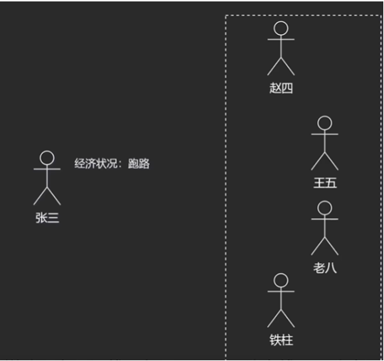
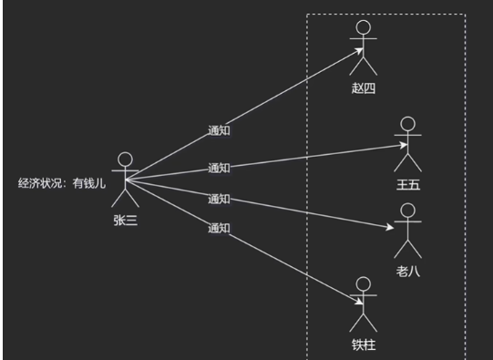

## 观察者模式

观察者模式：定义对象间的一种一对多的依赖关系，当一个对象状态发生改变时，其依赖对象皆被通知并被自动更新；

> 也是发布-订阅模式

假设现在张三欠了很多人钱，每个人都想找他还钱，如果每个人都一遍一遍的问张三，张三也很烦；



张三又很将信用，有一天，张三说：你们别一个个问了，请相信我，我有钱就**一个个通知你们，并把钱还回去**；



代码示例：

```java
import java.util.ArrayList;
import java.util.List;

public class ObserverPattern {
    public static void main(String[] args) {
        Debit zhangSan = new ZhangSan();
        zhangSan.borrow(new WangWu());
        zhangSan.borrow(new ZhaoSi());
        zhangSan.borrow(new LaoBa());

        zhangSan.setStatus(true);
        zhangSan.notifyCredit();
    }
}

// 借贷人
interface Debit{
    void borrow(Credit credit);
    void notifyCredit();
    void setStatus(boolean status);
}

// 银行爸爸
interface Credit{
    void takeMoney();
}

class ZhangSan implements Debit{
    // 通知队列
    private List<Credit> list = new ArrayList<>();
    private boolean status = false; // 表示是否有钱
    
    public void setStatus(boolean status){
        this.status = status;
    }

    @Override
    public void borrow(Credit credit) {
        // 添加一个观察者对象， 它观察我的状态
        list.add(credit);
    }

    @Override
    public void notifyCredit() {
        if(this.status) list.forEach(credit -> credit.takeMoney());
        else System.out.println("还没钱呢，催什么催？");
    }
}

class ZhaoSi implements Credit{
    private String name = "赵四";
    @Override
    public void takeMoney() {
        System.out.println(this.name + "已经拿到了钱");
    }
}

class WangWu implements Credit{
    private String name = "王五";
    @Override
    public void takeMoney() {
        System.out.println(this.name + "已经拿到了钱");
    }
}

class LaoBa implements Credit{
    private String name = "老八";
    @Override
    public void takeMoney() {
        System.out.println(this.name + "已经拿到了钱");
    }
}
```
