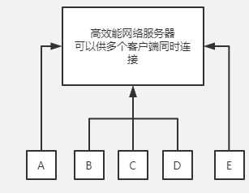
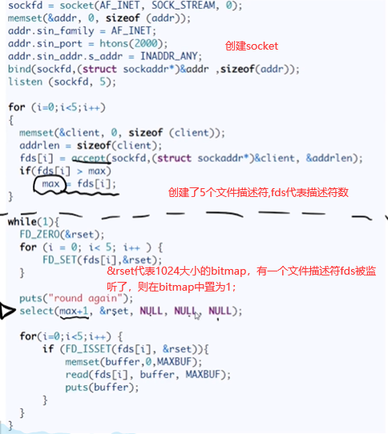
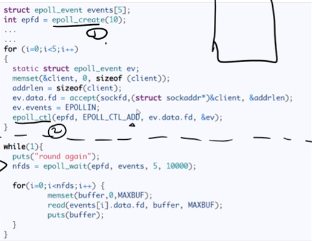

## 概述



> 如果服务器正在处理A的请求，此时B发生请求，B的请求会丢失吗？

答案： 不会，处理IO的设备并不是CPU而是专门有`DMA`控制器，因此单线程处理也不会丢失；

`DMA`：简单来说就是CPU不直接操作硬盘，对`DMA`下达指令，`DMA`告知硬盘，硬盘数据加载到内存中，然后返回给DMA，再返回给CPU，在CPU下单指令给`DMA`后，CPU则闲置；

**这也是为什么多线程比单线程快的原因；**

多线程：有CPU上下文的切换，并且有内核态的切换；

单线程下的伪代码：

```c++
while(1){
    for(fdx in (fdxs 数组)){
        if(fdx 有数据){
            处理 ...
        }
    }
}
```

## select

select源码：



select在运行时，会将`rset`拷贝到内核态，直接交给内核判断哪个fds启用了或者被监听了；

```c++
int select (int maxfd, 
            fd_set *readfds,                    						
            fd_set *writefds,                    
            fd_set *exceptfds,                    
            struct timeval *timeout);
```

- `maxfd`：代表要监控的最大文件描述符fd+1
- `writefds`：监控可写`fd`
- `readfds`：监控可读`fd`
- `exceptfds`：监控异常`fd`
- timeout：超时时长
  - NULL，代表没有设置超时，则会一直阻塞直到文件描述符上的事件触发
  - 0，代表不等待，立即返回，用于检测文件描述符状态
  - 正整数，代表当指定时间没有事件触发，则超时返回

缺点：

1. 1024的bitmap
2. `fdset` 不可重用
3.  用户态到内核态切换
4. 最后还需要O(n)循环 判断`fds`中的数据；

## poll

```c++
int poll (struct pollfd *fds, unsigned int nfds, int timeout);
```

`epoll`的改进基本都在这个`pollfd`结构体：

```c++
struct pollfd {
    int fd; //文件描述符
    short events; //监视的请求事件
    short revents; //已发生的事件 如果有数据则将revents置位
};
```

poll执行流程：

1. 将fd从用户态拷贝到内核态
2. 如果有数据则将对应的fd的revents置为POLLIN
3. 循环遍历，查找REVENTS = POLLIN的
4. 将revents 重置为0，方便复用
5. 对置位的fd进行读取和处理；

解决了select bitmap大小限制问题，和rset不重用问题

## epoll

epoll对应三个函数：

`epoll_create`  创建一个白板 存放`fd_events`
`epoll_ctl` 用于向内核注册新的描述符或者是改变某个文件描述符的状态。已注册的描述符在内核中会被维护在一棵红黑树上
`epoll_wait` 通过回调函数内核会将 I/O 准备好的描述符加入到一个链表中管理，进程调用 `epoll_wait`() 便可以得到事件完成的描述符

源码：



优化：

1. 当有置位时，则将其提到前面，并且最后返回nfds 表示有多少个被fd监听了
2. 可以避免内核态到用户态的切换，但是有歧义，有人说是共享内存，有的则说没有

歧义参考：https://www.zhihu.com/question/39792257


- [x] weasdfwr