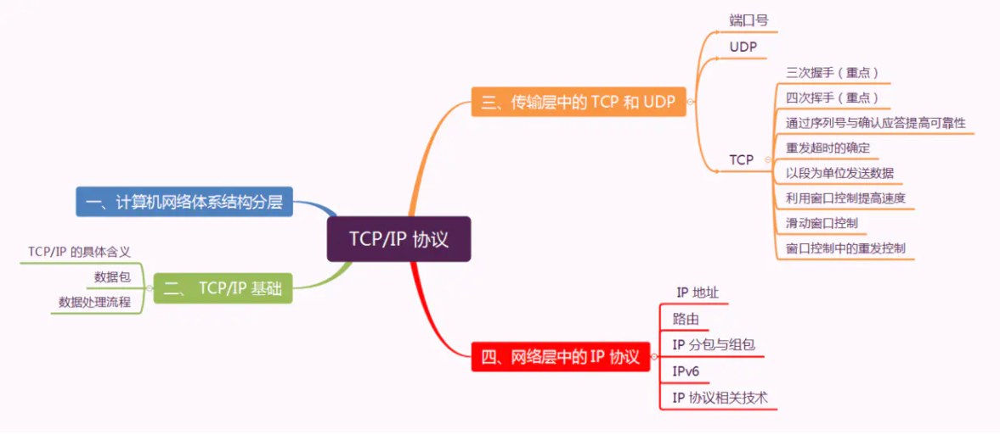
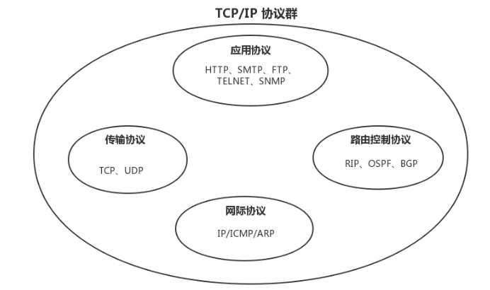
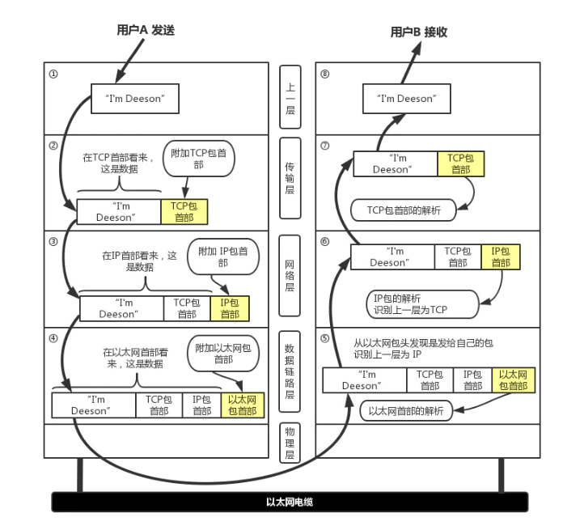
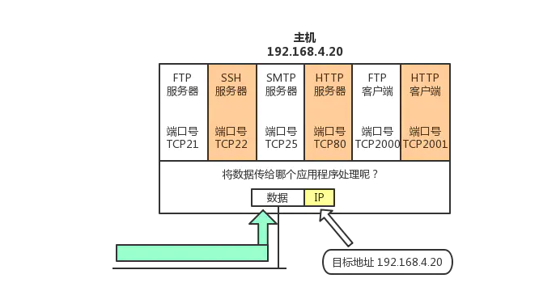
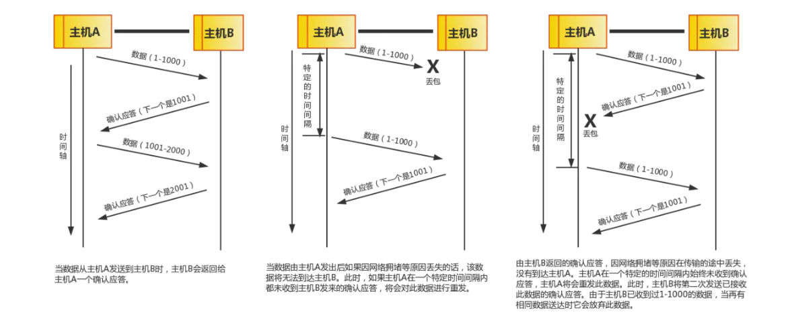
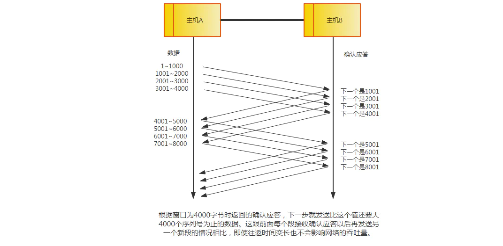
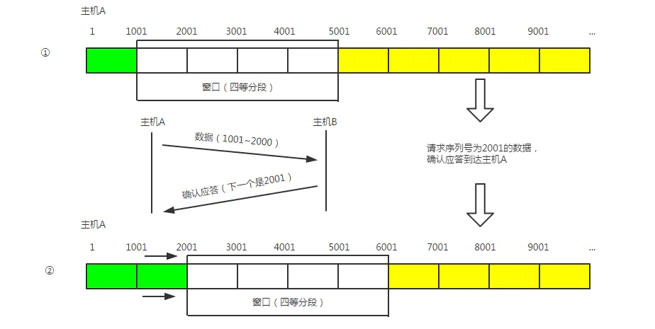
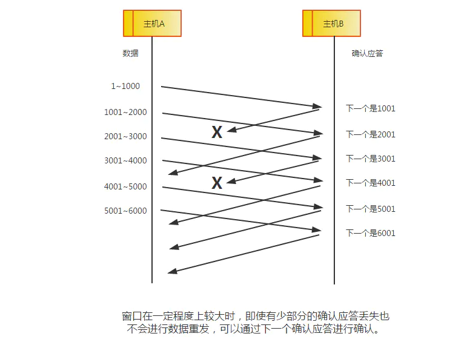
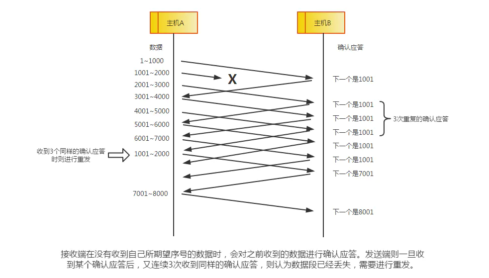

## TCP/IP协议

### TCP/IP

很多人认为TCP/IP就是tcp和ip协议，其实不然，tcp/ip指的是一个协议群，主要有，IP 或 ICMP、TCP 或 UDP、TELNET 或 FTP、以及 HTTP 等都属于 TCP/IP 协议。一般泛指这些协议群；

互联网协议就是TCP/IP，TCP/IP协议就是互联网协议族；

### 数据包

**包、帧、数据包、段、消息；**

- 包可以说是全能性术语；
- 帧是数据链路层包的单位
- 数据包是IP以及UDP网络层以上的包的单位
- 段是TCP数据流的信息
- 消息是应用层协议数据的单位

每个分层都会对所发送的数据附加一个首部；

网络传输的数据分两部分，一个是协议的首部，另一个是上层传过来的数据；包的首部明确标明了协议如何读取数据；**包首部就像协议的脸。**

### 数据处理流程

+ TCP 模块：负责建立和断开连接。提供可靠的传输，为了实现可靠需要在应用层数据添加TCP首部
+ IP 模块：在TCP首部的前端添加IP首部，参考路由控制表决定此IP包的路由或主机
+ 网络接口（以太网驱动）： 附加以太网首部，生成以太网数据通过物理层传输给接收端
+ 网络接口（以太网驱动）：收到后，首先通过以太网首部找到MAC地址判断是否为自己发送的包，如果不是则丢弃，如果是则传给对应的ARP或者IP；
+ IP 模块:  首先判断IP首部是否和自己的IP匹配，如果不匹配则通过路由器的路由控制表进行转发，如果匹配则转交给TCP、UDP；
+ TCP 模块：先计算下校验和，判断数据是否被破坏，然后按照序号接收数据。最后检查端口号，确定具体的应用程序；
+ 应用程序处理：接收端应用程序会直接接收发送端发送的数据。 通过解析数据，展示相应内容；

#### 端口号

数据链路和IP中的地址分别只MAC地址和IP地址。前者识别同一链路不同的计算机，后者识别主机和路由器。而在传输层中有端口号，主要对接不同的应用程序。因此也被称为**程序地址**；

**1、根据端口号识别应用**

一台计算机可以运行很多程序，而传输层就是利用端口号识别真在通信的应用程序，准确传输；

+ 标准既定的端口号：这种也叫静态方法。每个应用程序有指定的端口号，但不能随意指派。如HTTP,FTP,TELNET等被广泛应用协议使用的端口号是固定的；通常**0~1023**之间；
+ 时序分配法： 服务器要监听确定的端口号，但是交给操作系统进行+1分配。
  动态分配的端口号取值范围在49152到65535之间。

#### 通过序列号与确认应答提高可靠性

+ 在TCP中，发送端数据到达主机时，接收端会返回一个ACK代表确认应答；

+ 如果一段时间内没有收到确认应答，则可以认为数据已经丢失，进行重发，**由此即使产生了丢包，但仍能保证数据能够到达对方，实现可靠传输**；

+ 未收到ACK也不代表一定是数据丢失，也可能是ACK在中途丢失，但是发生方依然重发数据，会导致重复发送；

+ 此外也可能是一些其它原因导致ACK延迟到达。此时源主机也是重发数据

+ 故：为了实现可靠传输，丢弃重复的数据包，我们引入了**序列号**

+ **序列号是按顺序发送数据的每一个字节都标上号码的编号。接收端将下一步要接受的序列号作为应答返回过去。**

  

#### 超时重传

+ 重发超时是重发之前，等待确认应答到来的特定时间间隔，如果超过这个时间间隔没收到确认应答，则重发数据；
+ 数据不会被无线重发，因为超过一定重发次数后，可以判断网络对端主机发生异常，可以强制关闭连接；

#### 以段为单位发送数据

+ 在建立TCP连接时，确定数据包的单位，最理想的情况是，"最大消息长度"(MSS)正好是IP中不会被处理的最大数据长度。
+ TCP在传输大量数据时，以MSS大小进行数据分割发送，重发时也是；
+ MSS在三次握手，两端主机之间被计算得出；双方在建立连接请求时，会在TCP首部写入MSS选项，告诉对方自己能适应的MSS大小，然后双方选一个较小的值使用

#### 利用窗口提高速度

+ TCP以一个段为单位，每发送一个段就进行一次确认应答肯定浪费时间；
+ 故引用窗口，提高速度，只要应答更大的单位就行了；

> 滑动窗口控制

+ 如果1001 ~ 2001 内有数据出现丢包，如1380，但是也可以继续发送1381，直到一直没收到2001的确认，发送端就要重传；
+ 发送端要缓存被重传的数据，知道他们应答位置，再将其从缓存中清除
+ 收到2001确认就将窗口滑动到2001的位置，这样有顺序的将多段同时发送，提高了通信性能的机制叫**滑动窗口控制**；

#### 窗口控制的重发

在窗口控制中，重发有两种情况:

+ 确认应答未能返回，但数据已到达对端，不需要进行重发；

如下一个应答1001丢失了，但是我收到了2001的应答，那么即使我没收到1001的应答，也不用进行数据重发；

+ 当某个报文段丢失，接受主机收到序号以外的数据时，会不断发送(比如1001)的确认应答，如果同一个序列号应答重复返回，发送端会将数据进行重发。这种机制比之前提到的超时管理更加高效，因此也被称为**高速重发控制**。

  

### IP协议

ip 主要位于第三层 --- 网络层。主要实现点对点通信

网络的下一层 --- 数据链路层作用在同一数据链路节点，当要在不同数据链路节点时，需要借助网络层；

**IP大致分为三大模块：IP寻址、路由、IP分组与组包**

IP地址分类：

+ **A 类 IP 地址是首位以 “0” 开头的地址。**从第 1 位到第 8 位是它的网络标识。用十进制表示的话，0.0.0.0~127.0.0.0 是 A 类的网络地址。A 类地址的后 24 位相当于主机标识。因此，一个网段内可容纳的主机地址上限为16,777,214个。

+ **B 类 IP 地址是前两位 “10” 的地址。**从第 1 位到第 16 位是它的网络标识。用十进制表示的话，128.0.0.0~191.255.0.0 是 B 类的网络地址。B 类地址的后 16 位相当于主机标识。因此，一个网段内可容纳的主机地址上限为65,534个。
+ **C 类 IP 地址是前三位为 “110” 的地址。**从第 1 位到第 24 位是它的网络标识。用十进制表示的话，192.0.0.0~223.255.255.0 是 C 类的网络地址。C 类地址的后 8 位相当于主机标识。因此，一个网段内可容纳的主机地址上限为254个。
+ **D 类 IP 地址是前四位为 “1110” 的地址。**从第 1 位到第 32 位是它的网络标识。用十进制表示的话，224.0.0.0~239.255.255.255 是 D 类的网络地址。D 类地址没有主机标识，常用于多播。

#### 路由

+ 仅仅有IP地址不足以实现将数据包发送到目的地址，还需要“指明路由器或主机”信息。保存这种信息的就是路由控制表
+ 路由控制表有两种方式形成：手动设置和路由交换信息时自动刷新，前者叫**静态路由**，后者叫**动态路由**；

#### IP地址和路由控制

+ IP地址的网络地址部分用于路由控制
+ 路由控制表中记录了下一跳
+ 在发送IP包时，先确定**IP包首部**的**目的地址**，再从**路由控制表**中找出该地址的具体**网络地址**，然后进行下一跳重复该操作；如果路由控制表中存在多条相同网络地址的记录，就选择一个最为吻合的网络地址。

### IPV6

+ IPV6是为了解决IPV4地址耗尽的问题，IPV6由8个16位字节；

### DHCP

- 如果逐一为每一台主机设置 IP 地址会是非常繁琐的事情。特别是在移动使用笔记本电脑、只能终端以及平板电脑等设备时，每移动到一个新的地方，都要重新设置 IP 地址。
- 于是，为了实现自动设置 IP 地址、统一管理 IP 地址分配，就产生了 DHCP（Dynamic Host Configuration Protocol）协议。有了 DHCP，计算机只要连接到网络，就可以进行 TCP/IP 通信。也就是说，DHCP 让即插即用变得可能。

