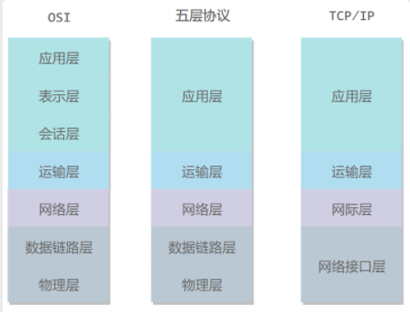

# 计算机网络体系结构

## 五层协议

+ 应用层：为特定应用程序提供数据传输服务，例如 HTTP、DNS 等协议。数据单位为**报文**。
+ 传输层：TCP/UDP，数据单位为用户**数据报**
+ 网络层：为**主机**提供数据传输服务。而传输层协议是为主机中的**进程**提供数据传输服务。**网络层把传输层的数据报封装成分组**。
+ 数据链路层：Mac，ARP，RARP; **将网络层的分组封装成帧**；
+ 物理层：决定物理性质。

## OSI

+ 表示层：数据压缩、加密等；
+ 会话层：建立和管理会话；

## 数据在各层之间的传递

向下则添加首部和尾部，向下则拆开；

路由器只有下面三层协议，因为路由器位于网络核心中，不需要为进程或者应用程序提供服务，因此也就不需要传输层和应用层。

## 通信方式

根据信息在传输线上的传送方向，分为以下三种通信方式：

- 单工通信：单向传输（一次连接只能单方传输）
- 半双工通信：双向交替传输 （一次连接一个时间段只能单方传输）
- 全双工通信：双向同时传输 （双方可以同时传输）