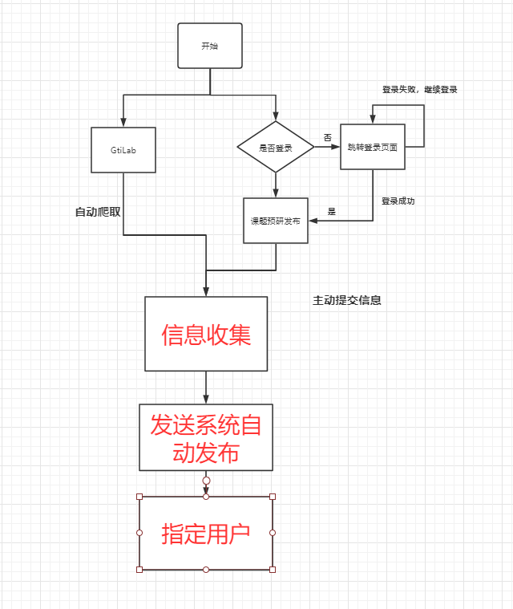

## 需求背景

富途研发人员，每周都会学习新的技术和新的知识，预研的新功能和新发现，可以通过该系统传达给相关人员。及时跟进新技术。

项目开发中新发布的功能，通过tag的方式上传至gitlab，此后可通过该系统自动爬取，并且告知相关人员。及时了解开发进度。

## 需求概述

1、对于进入发布页面的用户，会判断其是否有登录态

2、可将预究的课题主动发布，并在每周五或某特定时间进行推送

​			推送方式有短信推送、邮件推送、企业微信号

3、通过脚本自动获取GitLab上的tag，在每周或者每月某个特定的时间发送收集到的所有tag信息

4、发布后的所有内容，可通过List页面查看

5、后续可能开发权限管理功能，方便管理员管理权限已经删除页面等

## 需求详请

1、信息收集服务

1.1 预研新课题的人，可以通过发布页面，将预研成果信息传入此系统

2.2 项目开发过程中，可以将新提交Tag信息自动存入该系统

2、消息发生服务

2.1 通过接入 XX 服务，我们可以通过邮件、短信、客服机器人等方式，将收集的消息进行传达

3、查看已发消息展示页面

3.1 消息发出之后，可以通过展示页面，查看已发送的消息，我们将该消息分为两个部分，一部分是预研新技术，另一部分是gitlab上Tag标签。

4、信息发收集发布流程

